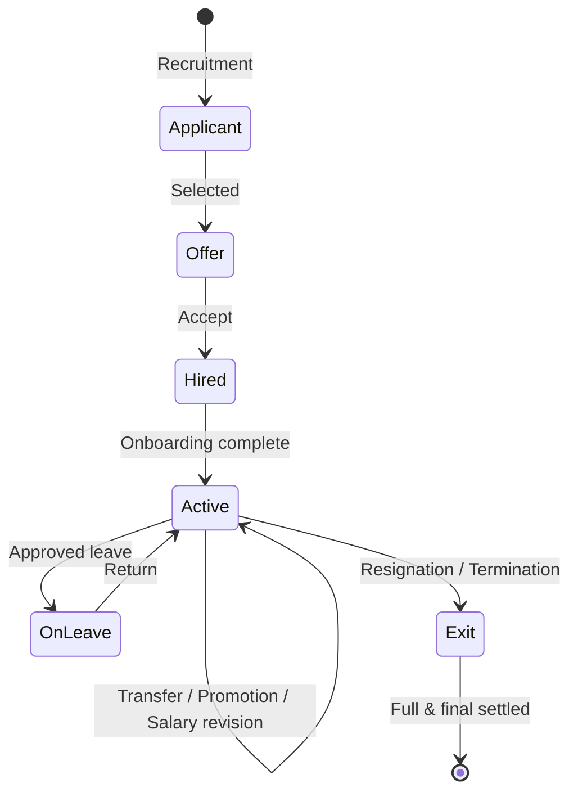
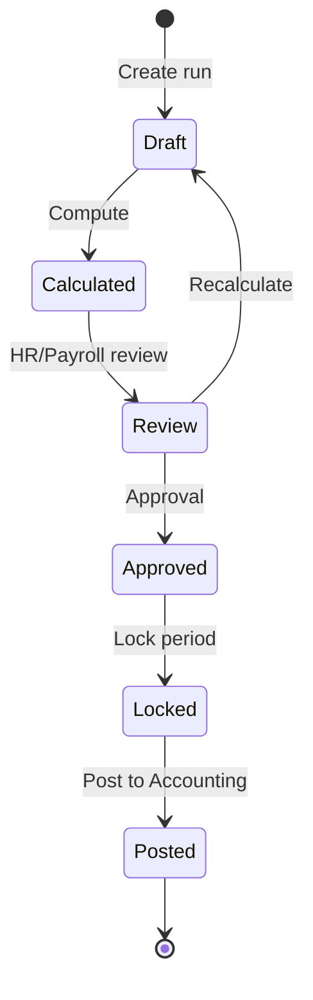

# AgainERP — HR & Payroll Master Architecture

> **Status:** Draft (Planning)  
> **Version:** 1.0  
> **Module:** HR & Payroll (unified enterprise suite)  
> **Document Type:** Master Enterprise Architecture  
> **Phase:** Documentation First · Architecture & Planning Only  
> **Route Namespace:** `/hr/*` · `/payroll/*` (employee self-service: `/ess/*`)  
> **Governance:** [GOVERNANCE.md](../../GOVERNANCE.md) · **Common rules:** [PROJECT_COMMON_RULES.md](../../PROJECT_COMMON_RULES.md)  
> **Related:** [../hr/Architecture.md](../hr/Architecture.md) · [../payroll/Architecture.md](../payroll/Architecture.md) · [MASTER_MODULE_ARCHITECTURE.md](../../MASTER_MODULE_ARCHITECTURE.md) · [UNIVERSAL_MODULE_FRAMEWORK.md](../../UNIVERSAL_MODULE_FRAMEWORK.md) · [AI_OS_ARCHITECTURE.md](../ai/AI_OS_ARCHITECTURE.md) · [ACTIVITY_CHATTER_ARCHITECTURE.md](../core/ACTIVITY_CHATTER_ARCHITECTURE.md) · [database/multi-company.md](../../database/multi-company.md)

**No backend code. No database implementation. No UI implementation. No API implementation.**  
This document is the **source of truth** for AgainERP's unified **HR & Payroll** enterprise module — workforce lifecycle, time, compensation, performance, and employee experience from hire to exit.

**Table namespaces:** `hr_*` (workforce & time) · `payroll_*` (compensation & compliance)  
**API bases:** `/api/v1/hr/` · `/api/v1/payroll/` · `/api/v1/ess/` (employee self-service)

---

## Executive Summary

**HR & Payroll** is AgainERP's **core enterprise workforce module** — the system of record for people, organization, time, pay, and talent. It is designed for **SME**, **Enterprise**, **Group of Companies**, and **multi-tenant SaaS** deployments from day one.

| Principle | Rule |
|-----------|------|
| **Identity in Core** | Person = `contacts`; employment = `hr_employees` |
| **Payroll boundary** | Compensation calculation in `payroll_*` only; HR supplies inputs |
| **No cross-module DB** | Accounting, Project, Inventory read via Service APIs and events |
| **Documentation-first** | This doc precedes Database, Workflow, UI, API, and AI child docs |
| **AI-ready** | All actions via governed HR/Payroll Service APIs — AI OS never touches tables |
| **Activity everywhere** | Every employee, attendance row, leave, payslip, asset change has timeline |
| **Multi-scope** | `tenant_id` → `company_id` → `branch_id` → `department_id` → `location_id` |
| **Optional but central** | Installable per tenant plan; when off, other modules degrade gracefully |

### Design inspiration (adapted, not copied)

| Source | What AgainERP adopts |
|--------|---------------------|
| **Odoo HR** | Unified employee, attendance, leave, payroll linkage |
| **Oracle HCM** | Enterprise org model, workforce lifecycle, compliance posture |
| **SAP SuccessFactors** | Performance, goals, learning as first-class domains |
| **Workday** | Employee-centric profile, self-service, approval workflows |
| **Zoho People** | SME-friendly ESS, shift/leave simplicity |
| **ERPNext HRMS** | Practical payroll runs, salary structures, loan recovery |

AgainERP **does not** duplicate vendor models — it unifies them under Core + `hr_*` + `payroll_*` with AgainERP AI OS, Activity Chatter, and multi-tenant rules.

---

## 1. Module Vision

### Problem today (without unified HR & Payroll)

| Gap | Impact |
|-----|--------|
| Employee data scattered across contacts, users, spreadsheets | Payroll errors, compliance risk |
| Attendance in hardware silos (ZKTeco, eSSL) | Manual reconciliation, late pay |
| Leave and payroll disconnected | Incorrect deductions, disputes |
| No single lifecycle view | Lost history on transfer, promotion, exit |
| Performance and training bolted on | No link to compensation and succession |

### Vision statement

> **One workforce record. Full lifecycle traceability. Accurate time. Compliant pay. AI-assisted insights — all through governed services.**

```text
                    ┌─────────────────────────────────────┐
                    │      Core Contacts (identity)        │
                    │  name · email · phone · addresses    │
                    └─────────────────┬───────────────────┘
                                      │ contact_id
                    ┌─────────────────▼───────────────────┐
                    │         hr_employees (employment)    │
                    │  org · status · manager · cost ctr   │
                    └───────┬─────────┬─────────┬─────────┘
                            │         │         │
              ┌─────────────▼──┐ ┌────▼────┐ ┌──▼──────────────┐
              │ HR domain       │ │ Payroll │ │ Talent domain    │
              │ Attendance      │ │ Runs    │ │ Performance      │
              │ Leave · Shifts  │ │ Payslip │ │ Training · Goals │
              │ Recruitment     │ │ Tax     │ │ Recruitment      │
              └────────┬────────┘ └────┬────┘ └────────┬─────────┘
                       │               │                  │
                       └───────────────┼──────────────────┘
                                       ▼
                         Accounting · Project · Analytics
                         (events + Service APIs only)
```

### Module off behavior ([PROJECT_COMMON_RULES.md](../../PROJECT_COMMON_RULES.md))

```text
HR & Payroll OFF:
  ✓ Core contacts and users still work
  ✓ Purchase/Sales/Inventory unaffected
  ✗ Employee directory, attendance, payslips hidden
  ✗ hr_* / payroll_* tables not queried
  ✗ Payroll journal subscriber skipped (Accounting no-op)
  ✗ AI HR tools return ModuleNotEnabled
```

---

## 2. Business Goals

| Goal | KPI / outcome |
|------|----------------|
| **Single source of truth** | One employee record per person per company |
| **Pay accuracy** | &lt; 0.5% payroll adjustment rate post-lock |
| **Time integrity** | Device + manual attendance reconciled daily |
| **Compliance readiness** | Audit trail on every pay component and employment change |
| **Manager productivity** | Leave/OT/expense approvals in &lt; 2 clicks |
| **Employee experience** | ESS: payslips, leave, profile without HR desk |
| **Group reporting** | Consolidated headcount and payroll cost across companies |
| **SaaS scale** | Per-tenant isolation; plan-based feature flags |
| **AI augmentation** | Insights and NL commands without bypassing approval |

---

## 3. Core Principles

| # | Principle | Rule |
|---|-----------|------|
| 1 | **Core-first identity** | `hr_employees.contact_id` → `contacts.id` (required); no `hr_persons` table |
| 2 | **Single table owner** | HR owns `hr_*`; Payroll owns `payroll_*` |
| 3 | **Service-only integration** | Accounting, Project, Inventory use APIs/events |
| 4 | **Workflow-native** | Leave, attendance correction, payroll run, loan use Core Workflow |
| 5 | **Approval-native** | Manager chains via Core Approval Engine |
| 6 | **Immutable pay history** | Posted payslips and locked payroll runs are append-only |
| 7 | **Activity on everything** | Global Activity & Chatter on all HR entities |
| 8 | **API-first** | Web, mobile, biometric devices, AI use same APIs |
| 9 | **Multi-company by design** | `company_id` on every business row; group views are read models |
| 10 | **AI through services** | AI OS registers tools → `HrService` / `PayrollService` only |
| 11 | **Documentation-first** | Child docs: Database, Workflow, UI, API, AI before code |
| 12 | **Drawer CRUD (UI)** | List + right Sheet drawer — no `/new` routes ([PROJECT_COMMON_RULES.md](../../PROJECT_COMMON_RULES.md)) |

---

## 4. Module Scope

### In scope (HR & Payroll suite)

| Domain | Owner namespace | Description |
|--------|-----------------|-------------|
| Organization structure | `hr_*` | Companies, branches, departments, locations, cost centers |
| Employee master | `hr_*` + Core `contacts` | Full employment profile and lifecycle |
| Recruitment | `hr_*` | Job openings, applicants, interviews, offer |
| Attendance | `hr_*` | Device sync, manual, correction workflow |
| Shifts | `hr_*` | Templates, rotation, rules, auto-assignment |
| Leave | `hr_*` | Types, accrual, approval, calendar |
| Payroll | `payroll_*` | Structures, runs, payslips, tax, compliance |
| Overtime | `hr_*` + `payroll_*` | Rules in HR; amounts in Payroll |
| Loans & advances | `payroll_*` | Recovery via payroll deduction |
| Performance | `hr_*` | Goals, KPI, KRA, appraisal cycles |
| Training | `hr_*` | Courses, schedules, certification |
| Assets | `hr_*` | Assignment, return, damage, history |
| Travel & expense | `hr_*` | Requests, approvals (Accounting integration via events) |
| Documents | Core `attachments` + HR links | Contracts, IDs, certificates |
| Employee self-service | `ess` API surface | Profile, leave, payslips, requests |
| Reporting | HR + Payroll | Operational and compliance reports |
| Settings | `hr_*` / `payroll_*` | Calendars, policies, device connectors |
| AI HR Assistant | AI OS tools | NL commands, insights (future phases) |

### Out of scope (other modules)

| Domain | Owner module |
|--------|--------------|
| GL, AP payroll journals (detail) | Accounting (subscriber to `payroll.run.posted`) |
| Project tasks, billing | Project |
| Billable time detail | Timesheet (feeds HR/Payroll) |
| User authentication | Core Users |
| Full statutory e-filing to government | External compliance connectors (future) |
| Helpdesk tickets | Helpdesk |

---

## 5. Module Boundaries

### HR owns

- Employment records, org structure, attendance, leave, shifts  
- Recruitment through hire conversion  
- Performance, training, assets, travel/expense **requests**  
- Workforce events: `hr.employee.*`, `hr.attendance.*`, `hr.leave.*`

### Payroll owns

- Salary structures, components, tax rules, contribution rules  
- Payroll runs, payslips, locking, bank export files  
- Loan/advance schedules and recovery  
- Pay events: `payroll.run.*`, `payroll.payslip.*`

### Core owns

- `contacts`, `addresses`, `users`, `companies`, `branches`  
- Activities, comments, attachments, audit logs  
- Workflow and Approval engines

### Integration contract (forbidden vs required)

| ❌ Forbidden | ✅ Required |
|-------------|------------|
| Accounting `JOIN hr_employees` | `HrService.getEmployee(id)` |
| Payroll direct update to `hr_attendance` | HR publishes `hr.attendance.finalized` |
| AI SQL on `payroll_payslips` | `PayrollService.getPayslipSummary(employeeId)` |

---

## 6. Multi Company Support

Aligns with [database/multi-company.md](../../database/multi-company.md) and [SAAS_PLATFORM_ARCHITECTURE.md](../../SAAS_PLATFORM_ARCHITECTURE.md).

```text
Tenant (SaaS platform)
└── Company (legal employer)
    └── Branch (operating unit)
        └── Location / Work site (geo, device zone)
            └── Department (org unit)
                └── Employee (scoped to company; may work across branches)
```

| Scope | Field | Rule |
|-------|-------|------|
| Platform | `tenant_id` | Mandatory on all `hr_*` and `payroll_*` tables |
| Legal entity | `company_id` | Mandatory; employee_number unique per company |
| Operating unit | `branch_id` | Attendance, shift, holiday scope |
| Org | `department_id` | Reporting, approvals, cost allocation |
| Physical | `location_id` | Device mapping, geo-fence check-in |
| Warehouse (optional) | `warehouse_id` | Only when HR ties to inventory asset custody |

### Group of Companies

| Capability | Design |
|------------|--------|
| **Shared employee across companies** | Separate `hr_employees` row per company; same `contact_id` |
| **Inter-company transfer** | Close employment A → open employment B; history preserved |
| **Consolidated reporting** | Read model / BI — no cross-company transactional writes |
| **Company switcher** | User with roles in multiple companies sees scoped data only |
| **Payroll per company** | Payroll run always single `company_id`; no cross-company pay run |

---

## 7. Multi Branch Support

| Use case | Behavior |
|----------|----------|
| Branch-specific holidays | `hr_holidays.branch_id` nullable = all branches |
| Attendance device | Device registered to `branch_id` |
| Shift templates | Default branch; override per location |
| Manager approval | Manager scope = department + branch (configurable) |
| ESS check-in | Validates employee's assigned branch or allowed branches |

---

## 8. Multi Department Support

```text
hr_departments
├── parent_id (tree)
├── manager_id → hr_employees
├── cost_center_id → hr_cost_centers
└── company_id
```

| Feature | Department role |
|---------|-----------------|
| Approval routing | Leave → reporting manager → dept head |
| Headcount budget | Optional headcount cap per department |
| Performance cycle | Appraisal by department or company-wide |
| Payroll cost allocation | `%` split across departments (optional) |
| Security | `hr.department.scope` — manager sees subtree only |

---

## 9. Multi Location Support

| Concept | Purpose |
|---------|---------|
| **Work location** | Office, factory, remote hub, client site |
| **Device zone** | Biometric devices mapped to location |
| **Geo-fence** | Mobile check-in validation (future) |
| **Outdoor duty** | Attendance status links to approved outdoor request |
| **Tax jurisdiction** | Location may drive payroll tax rules (country/region) |

---

## 10. Organization Structure

### Canonical org model

| Entity | Table (planned) | Notes |
|--------|-----------------|-------|
| Company | Core `companies` | Legal employer |
| Branch | Core `branches` | Operating unit |
| Department | `hr_departments` | Hierarchy |
| Job position | `hr_job_positions` | Title, grade, job family |
| Cost center | `hr_cost_centers` | Accounting dimension |
| Work location | `hr_locations` | Sites and geo |
| Reporting line | `hr_employees.manager_id` | Matrix reporting via secondary manager (future) |

### Org chart (conceptual)

```text
CEO
├── HR
│   └── HR Executive
├── Finance
├── Operations
│   ├── Production
│   └── Warehouse
└── Sales
    ├── Inside Sales
    └── Field Sales
```

Org changes emit `hr.department.changed` and `hr.employee.transfer` events for Analytics and AI context.

---

## 11. Employee Lifecycle

End-to-end workforce journey — each stage has workflow, permissions, activity timeline, and optional AI assistance.



| Stage | HR actions | Payroll actions | Key events |
|-------|------------|-----------------|------------|
| **Recruitment** | Job post, pipeline, interview | — | `hr.applicant.created` |
| **Hiring** | Offer letter, convert to employee | Pre-load salary structure (draft) | `hr.applicant.hired` |
| **Onboarding** | Checklist, documents, assets | Bank details, tax declarations | `hr.employee.hired` |
| **Employment** | Active service, transfers | Regular pay | `hr.employee.updated` |
| **Transfer** | Dept/branch/company change | Cost center update | `hr.employee.transferred` |
| **Promotion** | Grade/position change | Salary revision effective date | `hr.employee.promoted` |
| **Salary revision** | Compensation tab update | `payroll_employee_salaries` new row | `payroll.structure.changed` |
| **Performance** | Appraisal cycle | Bonus/commission input | `hr.appraisal.completed` |
| **Training** | Course completion | — | `hr.training.completed` |
| **Exit process** | Resignation, clearance, F&F | Final settlement run | `hr.employee.terminated` |

### Exit subprocess

1. Resignation / termination recorded  
2. Leave encashment calculated  
3. Asset return checklist  
4. Final payroll run (dues, deductions, gratuity rules per policy)  
5. Experience letter / documents  
6. User deactivation (event to Core)  
7. Retention policy on PII ([contacts](../../core/entities/contacts.md))

---

## 12. Complete Module Structure

Production navigation map (drawer CRUD for entities — [PROJECT_COMMON_RULES.md](../../PROJECT_COMMON_RULES.md)).

```text
/hr                                 → Dashboard (workforce KPIs)
/hr/employees                       → Employee directory
/hr/organization                    → Departments, positions, org chart
/hr/attendance                      → Daily attendance, corrections
/hr/shifts                          → Shift templates & assignments
/hr/leave                           → Leave requests & balances
/payroll                            → Payroll dashboard
/payroll/runs                       → Payroll run batches
/payroll/structures                 → Salary structures
/payroll/payslips                   → Payslip archive
/hr/overtime                        → Overtime requests & approvals
/payroll/loans                      → Loans & advances
/hr/recruitment                     → Openings & applicants
/hr/performance                     → Goals, appraisals
/hr/training                        → Courses & certifications
/hr/assets                          → Employee asset assignments
/hr/travel                          → Travel requests
/hr/expenses                        → Expense claims
/hr/documents                       → Policy & employee document hub
/ess                                → Employee self-service portal
/hr/reports                         → HR reports
/payroll/reports                    → Payroll & compliance reports
/hr/settings                        → HR policies, devices, calendars
/payroll/settings                   → Tax, components, bank formats
```

**Drawer query pattern:** `?create=1` · `?view={id}` · `?edit={id}` — no `/new` or `/[id]/edit` routes.

### Submodule summary

| Screen | Primary users | Core entities |
|--------|---------------|---------------|
| **Dashboard** | HR Manager, Admin | KPIs: headcount, absent today, pending leave, payroll status |
| **Employees** | HR | `hr_employees`, `contacts` |
| **Organization** | HR, Admin | `hr_departments`, `hr_job_positions` |
| **Attendance** | HR, Manager | `hr_attendance`, `hr_attendance_logs` |
| **Shifts** | HR | `hr_work_schedules`, `hr_employee_schedules` |
| **Leave** | HR, Manager, Employee | `hr_leave_requests`, `hr_leave_balances` |
| **Payroll** | Payroll Officer | `payroll_runs`, `payroll_payslips` |
| **Overtime** | Manager, HR | `hr_overtime_requests` |
| **Loan / Advance** | HR, Payroll | `payroll_loans`, `payroll_loan_repayments` |
| **Recruitment** | HR | `hr_job_openings`, `hr_applicants` |
| **Performance** | HR, Manager | `hr_goals`, `hr_appraisals` |
| **Training** | HR | `hr_courses`, `hr_training_enrollments` |
| **Assets** | HR, IT | `hr_asset_assignments` |
| **Travel / Expense** | Employee, Finance | `hr_travel_requests`, `hr_expense_claims` |
| **Documents** | HR | Core `attachments` |
| **Self Service** | Employee | Scoped `ess.*` permissions |
| **Reports** | HR, Payroll, Management | Report engine |
| **Settings** | Admin | Company policies |
| **AI HR Assistant** | All (governed) | AI OS embedded — Settings → AI |

---

## 13. Attendance Architecture

Enterprise-grade attendance — multi-source ingestion with reconciliation and audit.

### Data sources

| Source | Integration pattern | Frequency |
|--------|-------------------|-----------|
| **ZKTeco devices** | Connector service → API push or scheduled pull | Real-time / 15 min |
| **eSSL devices** | Same connector framework | Scheduled sync |
| **Fingerprint / face** | Device SDK → normalized `hr_attendance_logs` | Per punch |
| **API sync** | `/api/v1/hr/attendance/sync` (device token auth) | Push |
| **Scheduled sync** | Queue job per device | Cron |
| **Manual entry** | HR admin / manager with reason | On demand |
| **Bulk import** | CSV/XLS template → validation → staging | On demand |
| **Mobile / web check-in** | ESS geolocation optional | Real-time |
| **Timesheet** | Complementary billable hours (Timesheet module) | Daily |

### Connector architecture (conceptual)

```text
┌─────────────┐     ┌──────────────────┐     ┌─────────────────────┐
│ ZKTeco/eSSL │────►│ Attendance       │────►│ hr_attendance_logs  │
│ Biometric   │     │ Connector Service│     │ (raw punches)       │
└─────────────┘     └────────┬─────────┘     └──────────┬──────────┘
                             │ reconcile               │
                             ▼                         ▼
                    ┌────────────────────────────────────────┐
                    │ hr_attendance (daily summary per employee)│
                    └────────────────────────────────────────┘
```

Connectors are **stateless workers** — credentials in tenant settings; never bypass HR Service.

### Attendance status (canonical enum)

| Status | Code | Payroll impact |
|--------|------|----------------|
| Present | `present` | Full day pay |
| Absent | `absent` | Unpaid / leave deduction per policy |
| Late | `late` | Grace rules; optional deduction |
| Half day | `half_day` | 0.5 day factor |
| Leave | `leave` | Linked `hr_leave_requests` |
| Holiday | `holiday` | Paid holiday calendar |
| Weekend | `weekend` | Non-working |
| Work from home | `wfh` | Present equivalent |
| Outdoor duty | `outdoor` | Approved field work |

### Attendance correction workflow

1. Employee or HR submits correction request with reason  
2. Manager approval (Core Approval Engine)  
3. HR final approval (optional by policy)  
4. Original row preserved; correction creates audit entry  
5. Event `hr.attendance.corrected` → Payroll recalc if period open  

### Reconciliation rules

| Rule | Behavior |
|------|----------|
| First-in / last-out | Default pairing of punches |
| Missing punch | Flag for HR review; status `pending` |
| Duplicate punch | Deduplicate within 2-minute window |
| Cross-midnight shift | Attribute to shift start date |
| Device offline buffer | Store-and-forward from device |

---

## 14. Shift Management

| Shift type | Description |
|------------|-------------|
| **General shift** | Fixed start/end (e.g. 09:00–18:00) |
| **Night shift** | Crosses midnight; night allowance rules |
| **Rotational shift** | Cycle pattern (A/B/C teams) |
| **Flexible shift** | Core hours + flexible window |

### Shift rules engine

| Rule | Config |
|------|--------|
| **Grace time** | Minutes allowed before `late` status |
| **Late rules** | Deduction tiers after grace |
| **Early leave** | Minimum hours for full day |
| **Overtime rules** | OT after X minutes past shift end |
| **Break rules** | Paid/unpaid break minutes |
| **Auto shift assignment** | By department, location, or rotation pattern |

Tables (planned): `hr_work_schedules`, `hr_shift_rules`, `hr_employee_schedules`, `hr_shift_rotations`.

---

## 15. Leave Management

### Leave types (examples)

| Type | Paid | Accrual |
|------|------|---------|
| Annual | Yes | Monthly/yearly accrual |
| Sick | Yes | Annual grant |
| Casual | Yes | Fixed per year |
| Unpaid | No | — |
| Maternity / Paternity | Yes | Statutory rules |
| Compensatory off | Yes | From OT credit |

### Policies

| Feature | Design |
|---------|--------|
| **Accrual policy** | Per leave type: monthly rate, probation exclusion |
| **Carry forward** | Max days, expiry date |
| **Leave encashment** | On exit or annual window; payroll component |
| **Approval workflow** | Manager → HR (multi-level via Workflow Engine) |
| **Leave calendar** | Team view; clash detection |
| **Half-day leave** | First half / second half |
| **Negative balance** | Configurable block or allow with approval |

Events: `hr.leave.requested` · `hr.leave.approved` · `hr.leave.rejected` · `hr.leave.cancelled`

---

## 16. Payroll Architecture

Extends [../payroll/Architecture.md](../payroll/Architecture.md) with enterprise payroll design.

### Salary structure

```text
payroll_salary_structures
└── payroll_salary_structure_lines
        └── payroll_salary_components (earning | deduction | employer_contribution)
```

| Component examples | Type |
|--------------------|------|
| Basic salary | Earning |
| House rent allowance | Earning |
| Transport allowance | Earning |
| Income tax | Deduction |
| Provident fund (employee) | Deduction |
| Provident fund (employer) | Employer contribution |
| Loan recovery | Deduction |

### Calculation inputs (from HR)

| Input | Source |
|-------|--------|
| Payable days | `hr_attendance` summary |
| Leave without pay | Approved unpaid leave |
| Overtime hours | `hr_overtime_requests` approved |
| Loan EMI | `payroll_loan_repayments` schedule |
| Advance recovery | One-off deduction |
| Bonus / commission | Performance or manual input |

### Tax structure

- Bracket rules per jurisdiction (`payroll_tax_rules`)  
- Tax declarations from employee profile  
- Year-to-date tracking (`payroll_ytd_summaries`)  
- Compliance-ready: supports multiple country templates (implementation phase)

### Payroll run lifecycle



| Stage | Capability |
|-------|------------|
| **Draft** | Select period, employees, structure |
| **Calculated** | Engine computes payslip lines |
| **Review** | Exceptions report (missing attendance, etc.) |
| **Approved** | Approval Engine sign-off |
| **Locked** | No edits; payslips published to ESS |
| **Posted** | `payroll.run.posted` → Accounting journal |
| **Bank export** | CSV/ISO20022 format per bank template |

### Compliance-ready design

| Area | Approach |
|------|----------|
| Immutable payslips | Versioned PDF hash stored |
| Audit trail | Who approved, when locked |
| Statutory reports | Export templates per country |
| Retention | Payslip retention per legal policy |
| Segregation of duties | Calculator ≠ approver ≠ poster |

---

## 17. Employee Master Profile

Single **360° employee view** in drawer tabs (UI phase).

| Tab | Content |
|-----|---------|
| **Personal** | Core contact fields (read-through), photo |
| **Contact** | Phone, email, emergency contacts |
| **Employment** | Employee number, department, manager, status, dates |
| **Compensation** | Structure link (read); revision history |
| **Bank** | Account for salary credit (encrypted fields) |
| **Documents** | ID, contract, visas — Core attachments |
| **Assets** | Assigned laptops, phones, uniforms |
| **Education** | Degrees, institutions |
| **Experience** | Prior employment (pre-hire) |
| **Emergency** | Contacts, medical notes (restricted) |
| **Activity** | Global Activity & Chatter timeline |

### Employment status enum

`draft` · `active` · `on_probation` · `on_leave` · `suspended` · `terminated` · `archived`

---

## 18. Performance Management

| Concept | Description |
|---------|-------------|
| **Goals** | OKR-style objectives per period |
| **KPI** | Measurable metrics with targets |
| **KRA** | Key responsibility areas by role |
| **Appraisal** | Review cycle with self + manager rating |
| **Review cycle** | Annual, semi-annual, probation |
| **Promotion recommendation** | Workflow output linked to salary revision |

Events feed AI Performance Insights and succession planning (future).

---

## 19. Training Management

| Entity | Purpose |
|--------|---------|
| Courses | Catalog of internal/external training |
| Schedules | Sessions with capacity |
| Attendance | Who attended |
| Certification | Expiry tracking |
| Evaluation | Post-training feedback |

Links to Performance (skill gap → training assignment).

---

## 20. Asset Management

| Process | Description |
|---------|-------------|
| **Assignment** | Asset to employee with condition notes |
| **Return** | On exit or replacement |
| **Damage** | Chargeback workflow (optional payroll deduction) |
| **Replacement** | New assignment linked to old |
| **History** | Full custody chain in activity timeline |

Integration: optional link to Inventory fixed assets (UUID reference, not FK across modules).

---

## 21. Employee Self Service (ESS)

Route namespace: `/ess/*` · API: `/api/v1/ess/` · Permissions: `ess.*`

| Feature | Employee capability |
|---------|---------------------|
| Profile | View/update allowed fields |
| Attendance | View history; request correction |
| Leave | Apply, cancel, view balance |
| Payslips | Download PDF (post-lock only) |
| Documents | Upload requested docs |
| Assets | View assigned items |
| Requests | OT, travel, expense, loan application |
| Team calendar | Optional for team leads |

Mobile-first mandatory ([PROJECT_COMMON_RULES.md](../../PROJECT_COMMON_RULES.md)).

---

## 22. Reporting System

| Category | Examples |
|----------|----------|
| **Employee** | Headcount, turnover, demographics, probation due |
| **Attendance** | Daily register, late report, absenteeism, Muster roll |
| **Leave** | Balance summary, leave taken, encashment |
| **Payroll** | Salary register, component-wise, bank sheet, YTD tax |
| **Performance** | Appraisal status, rating distribution |
| **Compliance** | Statutory summaries, audit logs export |

Reports use Reporting Engine — no direct cross-module SQL in report definitions.

---

## 23. AI HR Assistant

Per [AI_OS_ARCHITECTURE.md](../ai/AI_OS_ARCHITECTURE.md) — AI is a **platform service**, not an HR submodule.

### Integration rules

| Rule | Implementation |
|------|----------------|
| No direct DB | Tools call `HrService` / `PayrollService` |
| Permission inherit | AI acts as current user |
| Human in the loop | Suggest → Review → Apply |
| Audit | Every AI action in `ai_audit_logs` + Activity tab |

### Future AI features (phased)

| Capability | Example |
|------------|---------|
| **Natural language commands** | "Show absent employees in Dhaka branch today" |
| **Attendance insights** | Anomaly detection, chronic lateness |
| **Payroll insights** | Cost forecast, overtime spike explanation |
| **Performance insights** | Rating calibration, flight risk (governed) |
| **Employee analytics** | Attrition drivers, hiring funnel |
| **Prediction** | Leave peak, staffing shortage |

### AI tool registration (planned)

`hr.list_employees` · `hr.get_attendance_summary` · `hr.get_leave_balance` · `payroll.get_run_status` · `payroll.explain_payslip` — all read-first; write tools require approval workflow.

---

## 24. Activity Log Architecture

Mandatory per [ACTIVITY_CHATTER_ARCHITECTURE.md](../core/ACTIVITY_CHATTER_ARCHITECTURE.md).

### Entities requiring full activity timeline

| Entity | Activity types logged |
|--------|----------------------|
| **Employee** | Hire, transfer, promotion, status change, document upload |
| **Attendance** | Punch, correction, manual override |
| **Leave** | Request, approve, reject, cancel |
| **Payroll run** | Create, calculate, approve, lock, post |
| **Payslip** | Generate, publish, download |
| **Asset** | Assign, return, damage |
| **Performance** | Goal set, appraisal submitted |
| **Training** | Enroll, complete, certify |
| **Loan** | Approve, disburse, recovery |

### UI pattern

- Activity icon column on all HR/Payroll list grids  
- Global Activity Drawer: Overview · Activities · Comments · Notes · Attachments · AI Actions  
- Field-level change log on employment and compensation fields  

---

## 25. Permission Architecture

Namespace: `hr.*` · `payroll.*` · `ess.*`  
Aligns with [core/PERMISSION_SYSTEM_ARCHITECTURE.md](../../core/PERMISSION_SYSTEM_ARCHITECTURE.md).

| Role | Typical permissions |
|------|-------------------|
| **Super Admin** | All companies, all settings |
| **Company Admin** | Full HR & Payroll within company |
| **HR Manager** | Employees, org, policies, all approvals |
| **HR Executive** | Day-to-day HR ops; limited settings |
| **Payroll Officer** | Payroll runs, structures, payslips; no hire/terminate |
| **Department Manager** | Team leave/OT/expense approve; team view |
| **Team Lead** | Sub-team attendance and leave (optional) |
| **Employee** | `ess.*` own data only |

### Record-level rules

| Rule | Example |
|------|---------|
| Company scope | `company_id` match session |
| Department scope | Manager sees `department_id` subtree |
| Self scope | Employee sees own `employee_id` only |
| PII field-level | Bank account, tax ID — `hr.sensitive.view` |

---

## 26. Layer & Classification

| Attribute | Value |
|-----------|-------|
| **Layer** | ERP (Layer 3) — **core enterprise workforce module** |
| **Installable** | Yes — per tenant plan (`module.hr`, `module.payroll` or bundle `module.hr_payroll`) |
| **Hard depends** | Core (Users, Contacts, Companies, Branches, Workflow, Approval, Activity) |
| **Soft depends** | Accounting, Project, Timesheet, Documents, Inventory (assets) |
| **Consumers** | Accounting (journals), Analytics, AI OS, BI |

---

## 27. Domain Events (summary)

### HR publishes

`hr.employee.hired` · `hr.employee.terminated` · `hr.employee.transferred` · `hr.employee.promoted` · `hr.attendance.recorded` · `hr.attendance.finalized` · `hr.attendance.corrected` · `hr.leave.approved` · `hr.leave.rejected` · `hr.appraisal.completed` · `hr.training.completed`

### Payroll publishes

`payroll.run.created` · `payroll.run.calculated` · `payroll.run.approved` · `payroll.run.locked` · `payroll.run.posted` · `payroll.payslip.published` · `payroll.structure.changed` · `payroll.loan.approved`

### HR & Payroll subscribe

| Event | Source | Action |
|-------|--------|--------|
| `core.user.created` | Core | Optional link to employee |
| `accounting.period.closed` | Accounting | Block payroll post to closed period |
| `project.task.completed` | Project | Optional performance input |

---

## 28. Child documentation roadmap

This master document is the foundation for:

| # | Child document | Purpose |
|---|----------------|---------|
| 1 | `Database.md` | Full `hr_*` / `payroll_*` schema plan |
| 2 | `Workflow.md` | State machines: leave, attendance correction, payroll run |
| 3 | `API.md` | REST contracts `/api/v1/hr/`, `/api/v1/payroll/`, `/api/v1/ess/` |
| 4 | `Permissions.md` | Full permission matrix |
| 5 | `INTEGRATION.md` | Accounting, Project, Timesheet, device connectors |
| 6 | `ModuleManifest.md` | Install, deps, feature flags |
| 7 | `docs/ui-prototype/hr-payroll/*` | UI build guide + screen specs |
| 8 | `AI.md` | Tool catalog for AI OS |
| 9 | `MODULE_DEPENDENCY_MAP.md` update | Register HR & Payroll edges |

**Pre-code gate:** Each child doc must reach **Ready** per [GOVERNANCE.md](../../GOVERNANCE.md) before implementation.

---

## 29. Alignment with existing AgainERP modules

| Existing doc | Relationship |
|--------------|--------------|
| [../hr/Architecture.md](../hr/Architecture.md) | **Subset** — this master doc supersedes for planning breadth; HR doc remains technical reference until merged |
| [../payroll/Architecture.md](../payroll/Architecture.md) | **Subset** — payroll tables and events preserved |
| [../timesheet/Architecture.md](../timesheet/Architecture.md) | Complementary time; OT export to Payroll |
| [MASTER_MODULE_ARCHITECTURE.md](../../MASTER_MODULE_ARCHITECTURE.md) | Layer 3 ERP; HR → Payroll → Accounting chain |

---

## 30. SaaS deployment considerations

| Topic | Design |
|-------|--------|
| **Tenant isolation** | All queries scoped by `tenant_id` |
| **Plan features** | Starter: HR only; Growth: + Payroll; Enterprise: + Performance, devices |
| **Data residency** | PII storage region per tenant (future) |
| **White-label ESS** | Tenant branding on self-service portal |
| **Usage metering** | Employee count, payroll runs per month (billing integration) |
| **Sandbox** | Demo employees and sample payroll run per tenant template |

---

## Document control

| Field | Value |
|-------|-------|
| **Module** | HR & Payroll |
| **Owner** | Platform / HR domain |
| **Status** | Draft (Planning) |
| **Version** | 1.0 |
| **Last Updated** | 2026-06-17 |
| **Next review** | After child Database.md + API.md draft |
| **Supersedes** | — (master); does not delete `hr/` or `payroll/` folders until merge |

---

**AgainERP HR & Payroll** — enterprise workforce architecture for SME, Enterprise, Group, and SaaS. Documentation first. AI-ready. Activity-complete. Core-aligned.
