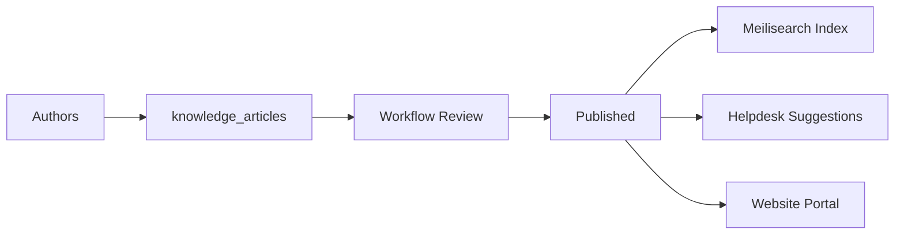

# Architecture — Knowledge

> **Status:** Draft  
> **Module:** Knowledge  
> **Phase:** 5 · Step 55  
> **Document Type:** Architecture  
> **Governance:** [MASTER_DATABASE_ARCHITECTURE.md](../../database/MASTER_DATABASE_ARCHITECTURE.md) · [MASTER_MODULE_ARCHITECTURE.md](../../MASTER_MODULE_ARCHITECTURE.md)

---

## Executive Summary

The Knowledge module provides a structured knowledge base — articles, categories, publishing workflow, and search — under the `knowledge_*` namespace. It serves internal agents (Helpdesk), employees (HR policies), and optionally public Website visitors. Search follows platform strategy: PostgreSQL FTS v1, Meilisearch v2 per [MASTER_DATABASE_ARCHITECTURE §14](../../database/MASTER_DATABASE_ARCHITECTURE.md#14-search-architecture).

| Goal | Target |
|------|--------|
| Self-service | Deflect tickets via published articles |
| Findability | Category tree + full-text search |
| Governance | Draft → review → publish lifecycle |
| Localization | Multi-language article translations |

---

## Mission

Capture organizational knowledge in searchable articles with controlled publishing, enabling support teams and customers to find answers quickly while maintaining content quality through review workflows.

---

## Scope & Boundaries

### In Scope

- Article authoring with rich content (HTML/JSON)
- Category hierarchy and permissions
- Publishing states and scheduled publish
- Article versioning and revision history
- Search indexing and analytics (views, helpful votes)
- Public and internal visibility scopes
- Links from Helpdesk tickets

### Out of Scope

- Arbitrary file library (Documents module)
- Live chat answers (Helpdesk)
- AI training corpus management (AI module orchestrates)
- Website theme rendering (Builder/Website)

---

## Key Entities & Tables

> **Prefix:** `knowledge_*` · Owner: **Knowledge**

| Table | Purpose | Key Relationships |
|-------|---------|-------------------|
| `knowledge_categories` | Category tree | → `companies`, `parent_id` |
| `knowledge_category_permissions` | Who can view category | → `roles`, `knowledge_categories` |
| `knowledge_articles` | Article master | → `knowledge_categories`, `author_id` |
| `knowledge_article_translations` | i18n content | → `knowledge_articles`, `locale` |
| `knowledge_article_versions` | Revision history | → `knowledge_articles` |
| `knowledge_article_tags` | Tag pivot | → `tags` or inline |
| `knowledge_article_feedback` | Helpful / not helpful | → `knowledge_articles`, `user_id`/`contact_id` |
| `knowledge_article_views` | View analytics | → `knowledge_articles`, date grain |
| `knowledge_search_synonyms` | Search tuning | → `companies` |
| `knowledge_related_articles` | Manual related links | article ↔ article |
| `knowledge_portal_settings` | Public KB branding | → `companies` |

### Content Storage

Article body in `knowledge_article_translations.content` (TEXT or JSONB for blocks). Featured images via Core `attachments` → `media`.

### Indexes

```text
knowledge_articles              (company_id, status, published_at DESC)
knowledge_article_translations    (article_id, locale) UNIQUE
knowledge_categories            (company_id, parent_id, slug) UNIQUE
GIN INDEX on to_tsvector(title, content)  -- PostgreSQL FTS
```

---

## Core Shared Entities (Not Owned by Knowledge)

| Core Entity | Knowledge Usage |
|-------------|-----------------|
| `users` | Authors, reviewers |
| `companies` | Tenant |
| `roles` | Category ACL |
| `tags` / `taggables` | Article tagging |
| `attachments` | Inline images, PDFs |
| `workflows` | Review/publish approval |
| `comments` | Internal review comments (optional) |

---

## Dependencies

### Core Platform

Workflow Engine, Search Service, Notification System, Reporting Engine, API Layer.

### Sibling Modules

| Module | Relationship |
|--------|--------------|
| **Helpdesk** | KB suggestions on tickets; `helpdesk_kb_links` |
| **Website** | Public KB portal pages |
| **HR** | Policy articles for employees |
| **Documents** | Attach source PDFs |
| **AI** | Article summary, semantic search (Phase 6) |
| **CRM** | Sales playbook articles (internal) |

---

## Domain Events

| Event | Publisher | Consumers |
|-------|-----------|-----------|
| `knowledge.article.created` | `knowledge_articles` | Workflow |
| `knowledge.article.submitted` | `knowledge_articles` | Reviewer notification |
| `knowledge.article.published` | `knowledge_articles` | Search index, Helpdesk |
| `knowledge.article.unpublished` | `knowledge_articles` | Search remove |
| `knowledge.article.feedback` | `knowledge_article_feedback` | Analytics |
| `knowledge.category.updated` | `knowledge_categories` | Portal cache bust |

### Subscribed Events

| Event | Source | Knowledge Action |
|-------|--------|------------------|
| `helpdesk.ticket.resolved` | Helpdesk | Suggest new article from resolution |
| `ai.content.generated` | AI | Draft article from approved output |

---

## API

| Property | Value |
|----------|-------|
| **Base path** | `/api/v1/knowledge/` |
| **Permission namespace** | `knowledge.*` |
| **Public API** | `/api/v1/knowledge/public/` (published only) |

### Representative Endpoints

| Method | Path | Purpose |
|--------|------|---------|
| GET/POST | `/articles` | Authoring list/create |
| POST | `/articles/{id}/submit` | Submit for review |
| POST | `/articles/{id}/publish` | Publish article |
| GET | `/categories` | Category tree |
| GET | `/search` | Full-text search |
| GET | `/public/articles` | Public KB (no auth) |
| GET | `/public/articles/{slug}` | Public article by slug |
| POST | `/articles/{id}/feedback` | Helpful vote |

Public endpoints CDN-cacheable; invalidate on `knowledge.article.published`.

---

## Integration Patterns



Helpdesk calls `GET /knowledge/search?q=` with ticket subject for suggestions.

---

## Security & Permissions

| Permission | Description |
|------------|-------------|
| `knowledge.articles.view` | Internal article read |
| `knowledge.articles.create` | Author drafts |
| `knowledge.articles.publish` | Publish approved content |
| `knowledge.categories.manage` | Category tree admin |
| `knowledge.public.manage` | Portal settings |

Category-level permissions override article visibility for internal KB.

---

## Future Integration Notes

| Area | Plan |
|------|------|
| **AI Search** | Vector embeddings in `ai_embeddings` |
| **AI Writer** | Draft from ticket resolutions |
| **Version diff** | Visual compare between versions |
| **Community** | Customer-contributed articles (moderated) |
| **Analytics** | Deflection rate vs Helpdesk volume |

Slug uniqueness: `(company_id, locale, slug)` on translations table.

---

**Module:** Knowledge  
**Last Updated:** 2026-06-12  
**Author:** —  
**Reviewers:** —
