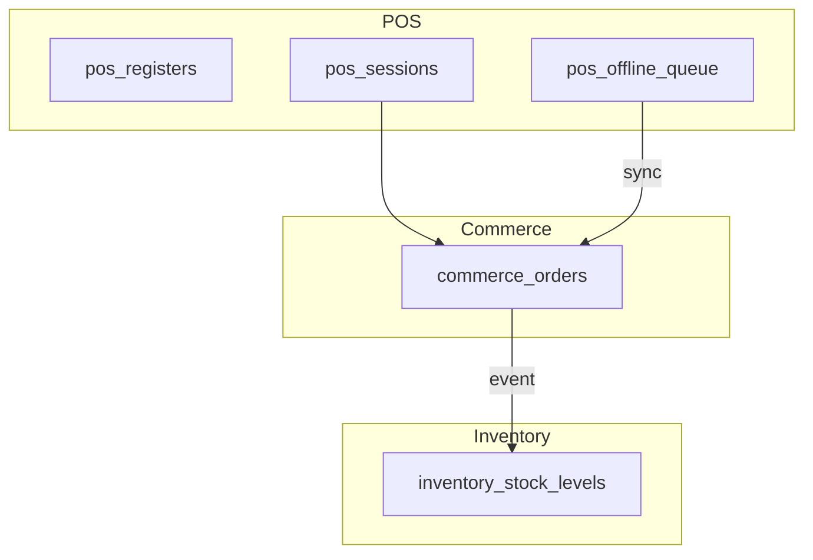

# Architecture — POS

> **Status:** Draft  
> **Module:** POS  
> **Phase:** 5 · Step 50  
> **Document Type:** Architecture  
> **Governance:** [MASTER_DATABASE_ARCHITECTURE.md](../../database/MASTER_DATABASE_ARCHITECTURE.md) · [MASTER_MODULE_ARCHITECTURE.md](../../MASTER_MODULE_ARCHITECTURE.md)

---

## Executive Summary

The POS module delivers in-store point-of-sale — register configuration, cashier sessions, fast checkout, and offline sync — under the `pos_*` namespace. Transactional orders use Commerce `commerce_orders` with `channel = 'pos'`; stock decrements flow through Inventory. POS owns session, register, and sync metadata only — not a parallel order schema.

| Goal | Target |
|------|--------|
| Checkout speed | < 3s sale completion on LAN |
| Offline resilience | Queue sales; sync on reconnect |
| Cash control | Session open/close reconciliation |
| Omnichannel | Same catalog and stock as Ecommerce |

---

## Mission

Enable retail staff to sell products in physical locations with barcode scanning, split payments, and receipt printing while maintaining a single order and inventory truth across online and in-store channels.

---

## Scope & Boundaries

### In Scope

- POS register and terminal configuration
- Cashier session lifecycle (open, close, cash count)
- POS-optimized checkout API
- Offline transaction queue and conflict resolution
- Receipt templates and hardware hooks (future)

### Out of Scope

- Product catalog (Catalog)
- Order line storage (Commerce `commerce_orders`)
- Stock ledger (Inventory)
- Payment settlement accounting (Accounting via events)

---

## Key Entities & Tables

> **Prefix:** `pos_*` · Owner: **POS**

| Table | Purpose | Key Relationships |
|-------|---------|-------------------|
| `pos_registers` | Terminal/register definition | → `branches`, `inventory_warehouses` |
| `pos_register_devices` | Device binding (tablet, printer) | → `pos_registers` |
| `pos_sessions` | Cashier shift | → `pos_registers`, `user_id` |
| `pos_session_cash_movements` | Cash in/out during shift | → `pos_sessions` |
| `pos_session_closings` | Close report, variance | → `pos_sessions` |
| `pos_order_links` | POS metadata on commerce order | → `commerce_orders`, `pos_sessions` |
| `pos_offline_queue` | Pending sync payloads | → `pos_registers`, JSONB payload |
| `pos_offline_conflicts` | Sync conflict log | → `pos_offline_queue` |
| `pos_payment_methods` | Cash, card, split config | → `companies` |
| `pos_receipt_templates` | Print layout | → `companies` |
| `pos_quick_keys` | Favorite products per register | → `catalog_product_variants` |

### Order Pattern

```text
commerce_orders.channel = 'pos'
commerce_orders.branch_id = register.branch_id
pos_order_links.commerce_order_id → commerce_orders.id
```

Inventory reservation/issue uses same events as Ecommerce checkout.

### Indexes

```text
pos_sessions           (company_id, register_id, status)
pos_offline_queue      (register_id, sync_status, created_at)
pos_order_links        (commerce_order_id) UNIQUE
```

---

## Core Shared Entities (Not Owned by POS)

| Core Entity | POS Usage |
|-------------|-----------|
| `users` | Cashier, session owner |
| `branches` | Store location |
| `contacts` | Walk-in customer (optional) |
| `companies` | Tenant |
| `catalog_product_variants` | Scanned SKU lookup (read API) |
| `tax_rules` | In-store tax |
| `attachments` | Receipt logo via Media |

---

## Dependencies

### Core Platform

Notification System, Reporting Engine, API Layer, Offline-capable client SDK.

### Sibling Modules

| Module | Relationship |
|--------|--------------|
| **Catalog** | Product search, barcode, price |
| **Inventory** | Real-time stock per warehouse |
| **Commerce** | `commerce_orders`, payments |
| **Sales** | Optional invoice for B2B counter sale |
| **Accounting** | Session close → cash journal |
| **Ecommerce** | Shared promotions/coupons (read) |

---

## Domain Events

| Event | Publisher | Consumers |
|-------|-----------|-----------|
| `pos.session.opened` | `pos_sessions` | Analytics |
| `pos.session.closed` | `pos_session_closings` | Accounting, Analytics |
| `pos.sale.completed` | `pos_order_links` | Inventory, Analytics |
| `pos.offline.synced` | `pos_offline_queue` | Commerce, Inventory |
| `pos.cash.variance` | `pos_session_closings` | Notifications, Accounting |

### Subscribed Events

| Event | Source | POS Action |
|-------|--------|------------|
| `inventory.stock.updated` | Inventory | Refresh local cache |
| `catalog.product.updated` | Catalog | Invalidate quick keys |
| `commerce.order.refunded` | Orders | Update session totals |

---

## API

| Property | Value |
|----------|-------|
| **Base path** | `/api/v1/pos/` |
| **Permission namespace** | `pos.*` |
| **Local API** | Optional LAN edge cache (future) |

### Representative Endpoints

| Method | Path | Purpose |
|--------|------|---------|
| POST | `/sessions/open` | Open cashier session |
| POST | `/sessions/{id}/close` | Close with cash count |
| POST | `/checkout` | Create `commerce_order` + payment |
| GET | `/products/search` | Barcode/name lookup (Catalog proxy) |
| POST | `/offline/push` | Upload queued transactions |
| GET | `/offline/pull` | Delta sync catalog/stock |
| GET | `/registers` | Register config |

`Idempotency-Key` mandatory on checkout and offline push.

---

## Integration Patterns



Offline queue stores full checkout payload; server idempotency prevents duplicate orders on retry.

---

## Security & Permissions

| Permission | Description |
|------------|-------------|
| `pos.session.open` | Open register session |
| `pos.checkout` | Complete sales |
| `pos.refund` | Process returns (may require manager PIN) |
| `pos.session.close` | Close and reconcile |
| `pos.registers.manage` | Admin register setup |

Manager override for discounts above threshold; logged in `activity_logs`.

---

## Future Integration Notes

| Area | Plan |
|------|------|
| **Hardware** | Receipt printer, cash drawer, barcode scanner drivers |
| **Card terminals** | Stripe Terminal, local payment acquirers |
| **Loyalty** | Marketing points earn on POS sale |
| **Kitchen display** | F&B order routing (Booking module) |
| **AI** | Basket recommendations at checkout |

Per [MASTER_DATABASE_ARCHITECTURE](../../database/MASTER_DATABASE_ARCHITECTURE.md), `pos_orders` may be deprecated in favor of `commerce_orders` + `pos_order_links`.

---

**Module:** POS  
**Last Updated:** 2026-06-12  
**Author:** —  
**Reviewers:** —
