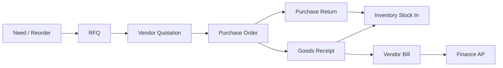

# AgainERP — Purchase Domain Entity Catalog

> **Status:** Approved  
> **Version:** 1.0  
> **Project:** AgainERP  
> **Domain:** Purchase (Procurement & Vendor Management)  
> **Document Type:** Business Entity Design Document  
> **Purpose:** Define all Purchase domain business entities — purpose, lifecycle, relationships, and platform capabilities  
> **Governance:** [GOVERNANCE.md](../../GOVERNANCE.md) · **Standards:** [DEVELOPMENT_STANDARDS.md](../../DEVELOPMENT_STANDARDS.md)

**No SQL schemas. No migrations. No DDL.**  
This document describes **business entities only** — procure-to-pay from vendor through RFQ, PO, receipt, billing, and returns.

### Step 29 Requirements (Satisfied)

| Requirement | Section |
|-------------|---------|
| Domain overview | §1 |
| Entity philosophy | §2 |
| Entity registry | §3 |
| Per-entity profiles (8 attributes each) | §4 |
| Workflow support (RFQ → Returns) | §5 |
| All 15 purchase entities | §3 · §4 |

**Related:** [PURCHASE_MODULE_ARCHITECTURE.md](./PURCHASE_MODULE_ARCHITECTURE.md) · [PURCHASE_WORKFLOW.md](./PURCHASE_WORKFLOW.md) · [ENTITY_INVENTORY.md](../inventory/ENTITY_INVENTORY.md) · [ENTITY_CATALOG.md](../ecommerce/catalog/ENTITY_CATALOG.md) · [ENTITY_RELATIONSHIP_REGISTRY.md](../../ENTITY_RELATIONSHIP_REGISTRY.md) · [DATABASE_REGISTRY.md](../../DATABASE_REGISTRY.md) · [TRACEABILITY_MATRIX.md](../../TRACEABILITY_MATRIX.md)

---

## Executive summary

| Principle | Rule |
|-----------|------|
| **Procure-to-pay spine** | Purchase owns procurement documents; Inventory owns qty; Finance owns AP |
| **Vendor via Core** | Vendor party = Core Contact — no duplicate vendor master table |
| **Product Master consumer** | Lines reference Catalog variant / Inventory Stock Item |
| **Orchestration not duplication** | Receipt triggers Inventory movement; Bill triggers Finance AP |
| **Approval native** | PO, contracts, match exceptions, and high-value returns are policy-gated |
| **AI assists, humans commit** | Agent suggests vendors and matches; award and post require approval |

```text
Purchase Domain Entities (15)
├── Vendor · Vendor Contact · Vendor Performance
├── RFQ · RFQ Item · Vendor Quotation
├── Purchase Order · Purchase Order Item
├── Goods Receipt · Goods Receipt Item
├── Vendor Bill · Vendor Bill Item
├── Purchase Return · Purchase Return Item · Purchase Contract
```

---

## 1. Domain overview

### 1.1 Purchase bounded context

The **Purchase** domain is AgainERP's **procurement and vendor management system** — from sourcing and vendor selection through purchase commitment, physical receipt, vendor invoicing, and returns.

| Concern | Purchase Owns | Purchase Does Not Own |
|---------|---------------|----------------------|
| Parties | Vendor profile extensions, Vendor Contacts | Core Contact legal record |
| Sourcing | RFQ, Vendor Quotation | — |
| Commitment | Purchase Order | — |
| Physical receipt | Goods Receipt (orchestration) | Stock Movement (Inventory) |
| Payables prep | Vendor Bill, three-way match | GL posting (Finance) |
| Returns | Purchase Return | Payment execution (Finance) |
| Agreements | Purchase Contract | — |
| Analytics | Vendor Performance | — |
| Product identity | Line references only | SKU, specs (Catalog) |

### 1.2 Procure-to-pay chain



### 1.3 Module consumers

| Consumer | Integration | Primary entities |
|----------|-------------|------------------|
| **Inventory** | Receipt → Stock In; Return → Stock Out; reorder suggestions | Goods Receipt, Purchase Order |
| **Finance** | Bill → AP; credit notes from returns | Vendor Bill, Purchase Return |
| **Catalog** | Variant on lines; cost sync from receipt | Purchase Order Item |
| **Sales** | Drop-ship PO (future) | Purchase Order |
| **Manufacturing** | MRP material PO (future) | RFQ, Purchase Order |
| **AI OS** | Vendor match, PO suggest, 3-way match assist | All documents |

### 1.4 Traceability

| Requirement | Purchase entities |
|-------------|-------------------|
| REQ-PURCHASE-001 | Vendor, Purchase Order, Goods Receipt, Vendor Bill |

**Service owner:** `PurchaseService` · **Agent:** Purchase Agent

---

## 2. Entity philosophy

### 2.1 Design principles

```text
One vendor truth in Core Contacts.
One product truth in Catalog.
Purchase documents chain forward — never skip receipt before stock.
```

| Principle | Application |
|-----------|-------------|
| **Aggregate roots** | RFQ, Purchase Order, Goods Receipt, Vendor Bill, Purchase Return, Purchase Contract |
| **Line items** | RFQ Item, PO Item, Receipt Item, Bill Item, Return Item |
| **Extension entities** | Vendor (profile on Core Contact), Vendor Contact, Vendor Performance |
| **Cross-module events** | `purchase.receipt.completed` → Inventory; `purchase.bill.posted` → Finance |
| **Quantity traceability** | PO line tracks ordered / received / billed / returned |

### 2.2 Entity profile schema

Every entity in §4 includes:

| Attribute | Description |
|-----------|-------------|
| **Purpose** | Business reason the entity exists |
| **Responsibilities** | What the entity is accountable for |
| **Relationships** | Logical links to other entities |
| **Lifecycle** | States and transitions |
| **Activities** | Timeline, chatter, audit support |
| **Permissions** | Primary permission keys |
| **Approval Support** | Workflow gates, if any |
| **AI Support** | Agents and tools that may read or propose changes |

### 2.3 Document boundaries

| This document | See instead |
|-------------|-------------|
| Business entity definitions | [PURCHASE_MODULE_ARCHITECTURE.md](./PURCHASE_MODULE_ARCHITECTURE.md) |
| Workflow state machines | [PURCHASE_WORKFLOW.md](./PURCHASE_WORKFLOW.md) · §5 below |
| Physical tables | [DATABASE_REGISTRY.md](../../DATABASE_REGISTRY.md) §5.3 |
| Stock impact | [ENTITY_INVENTORY.md](../inventory/ENTITY_INVENTORY.md) |

---

## 3. Entity registry

| # | Entity | Aggregate | Owner | REQ | Status |
|---|--------|-----------|-------|-----|--------|
| 1 | [Vendor](#41-vendor) | Root (Core + extension) | Core · Purchase profile | REQ-PURCHASE-001 | Documented |
| 2 | [Vendor Contact](#42-vendor-contact) | Child of Vendor | Core · Purchase | REQ-PURCHASE-001 | Documented |
| 3 | [RFQ](#43-rfq) | Root | Purchase | REQ-PURCHASE-001 | Documented |
| 4 | [RFQ Item](#44-rfq-item) | Child of RFQ | Purchase | REQ-PURCHASE-001 | Documented |
| 5 | [Vendor Quotation](#45-vendor-quotation) | Root | Purchase | REQ-PURCHASE-001 | Documented |
| 6 | [Purchase Order](#46-purchase-order) | Root | Purchase | REQ-PURCHASE-001 | Documented |
| 7 | [Purchase Order Item](#47-purchase-order-item) | Child of PO | Purchase | REQ-PURCHASE-001 | Documented |
| 8 | [Goods Receipt](#48-goods-receipt) | Root | Purchase | REQ-PURCHASE-001 | Documented |
| 9 | [Goods Receipt Item](#49-goods-receipt-item) | Child of Receipt | Purchase | REQ-PURCHASE-001 | Documented |
| 10 | [Vendor Bill](#410-vendor-bill) | Root | Purchase | REQ-PURCHASE-001 | Documented |
| 11 | [Vendor Bill Item](#411-vendor-bill-item) | Child of Bill | Purchase | REQ-PURCHASE-001 | Documented |
| 12 | [Purchase Return](#412-purchase-return) | Root | Purchase | REQ-PURCHASE-001 | Documented |
| 13 | [Purchase Return Item](#413-purchase-return-item) | Child of Return | Purchase | REQ-PURCHASE-001 | Documented |
| 14 | [Purchase Contract](#414-purchase-contract) | Root | Purchase | REQ-PURCHASE-001 | Documented |
| 15 | [Vendor Performance](#415-vendor-performance) | Derived | Purchase | REQ-PURCHASE-001 | Documented |

> **Note:** Vendor Quotation includes line-level response data (price, lead time, MOQ per RFQ line) as part of the quotation aggregate — no separate entity in registry.

---

## 4. Entity profiles

### 4.1 Vendor

| Attribute | Value |
|-----------|-------|
| **Purpose** | Supplier party — legal and commercial identity for all procurement |
| **Responsibilities** | Vendor code, payment terms, currency, lead time, MOQ, preferred/blocked flags; vendor item catalog mapping; spend and open PO visibility; anchor for RFQ, PO, bills, contracts |
| **Relationships** | → Core Contact (`contact_type=vendor`); → Vendor Contacts; → Purchase Vendor Profile extension; ↔ Vendor Performance; ← RFQs, Quotations, POs, Bills, Contracts, Returns |
| **Lifecycle** | onboarding → active → blocked → inactive |
| **Activities** | ✓ Full — profile edits, block/unblock, terms change, catalog mapping |
| **Permissions** | `core.contact.view/create/edit`; `purchase.vendor.read`, `.write` |
| **Approval Support** | Optional — vendor onboarding approval before first PO |
| **AI Support** | Vendor recommendation; duplicate vendor detect; spend consolidation suggest |

**Rule:** No separate `purchase_vendors` person table — vendor identity lives in Core Contacts.

---

### 4.2 Vendor Contact

| Attribute | Value |
|-----------|-------|
| **Purpose** | Person at a vendor organization — buyer communication, RFQ delivery, PO transmission |
| **Responsibilities** | Name, email, phone, role (sales, accounts, logistics); primary contact flag; RFQ/PO email routing; portal access token holder |
| **Relationships** | → Vendor (parent Core Contact or linked contact); ← RFQ vendor invitations; notification target for PO send |
| **Lifecycle** | active → inactive |
| **Activities** | ✓ Create, edit, primary flag change on vendor timeline |
| **Permissions** | `core.contact.edit`; `purchase.vendor.write` |
| **Approval Support** | — |
| **AI Support** | Suggest primary contact from email history |

---

### 4.3 RFQ

| Attribute | Value |
|-----------|-------|
| **Purpose** | Request for quotation — structured sourcing when price and terms must be compared before PO |
| **Responsibilities** | RFQ number, title, required date, delivery warehouse; invite vendors; track response deadline; comparison and award decision; convert winning quote to PO |
| **Relationships** | → RFQ Items (1:n); → invited Vendors; → Vendor Quotations; → Purchase Order (on award); → Branch, Warehouse, Buyer (User) |
| **Lifecycle** | draft → sent → vendor_response → quotation → approved → po_created → closed \| cancelled |

| **Activities** | ✓ Send, response received, comparison, award, PO link, cancel |
| **Permissions** | `purchase.rfq.read`, `.create`, `.award`, `.cancel` |
| **Approval Support** | **Yes** — award above threshold; non-preferred vendor override |
| **AI Support** | RFQ line fill; vendor ranking; price anomaly on responses; chase reminder |

**Workflow ID:** `purchase.rfq` · **Events:** `purchase.rfq.sent`, `.response_received`, `.awarded`, `.po_created`

---

### 4.4 RFQ Item

| Attribute | Value |
|-----------|-------|
| **Purpose** | Line on an RFQ — one product or service being sourced |
| **Responsibilities** | Requested quantity and UOM; Product Variant or free-text description; optional target budget price; line notes for vendors |
| **Relationships** | → RFQ (parent); → Product Variant / Stock Item (optional); ↔ Vendor Quotation lines (responses per vendor) |
| **Lifecycle** | open with RFQ → awarded \| cancelled with RFQ |
| **Activities** | ✓ Line add/edit on RFQ timeline |
| **Permissions** | `purchase.rfq.create` |
| **Approval Support** | Inherits RFQ award |
| **AI Support** | Suggest items from reorder rules or vendor catalog |

---

### 4.5 Vendor Quotation

| Attribute | Value |
|-----------|-------|
| **Purpose** | Vendor's quote response — captured from RFQ invitation or standalone upload |
| **Responsibilities** | Vendor reference number, validity date, currency, total; line prices, lead times, MOQs per RFQ item; PDF attachment; accept/reject for award |
| **Relationships** | → RFQ (optional parent); → Vendor; → quotation lines (per RFQ Item); → Purchase Order (when accepted and converted) |
| **Lifecycle** | draft → submitted → accepted \| rejected |

| **Activities** | ✓ Quote entry, PDF attach, accept/reject, comparison snapshot |
| **Permissions** | `purchase.quotation.read`, `.write`; vendor portal submit (external) |
| **Approval Support** | Acceptance triggers RFQ award approval (policy) |
| **AI Support** | Price anomaly vs contract/history; match confidence on PDF extract |

**Workflow ID:** `purchase.quotation`

---

### 4.6 Purchase Order

| Attribute | Value |
|-----------|-------|
| **Purpose** | Formal commitment to buy goods or services from a vendor at agreed terms |
| **Responsibilities** | PO number, vendor, dates, ship-to warehouse, payment terms, incoterms; line totals; approval before send; track receive/bill/return progress; contract release reference |
| **Relationships** | → Vendor; → Purchase Order Items; → Goods Receipts; → Vendor Bills; → Purchase Returns; → Purchase Contract (optional); → Warehouse, Branch, Buyer |
| **Lifecycle** | draft → pending_approval → approved → ordered → partially_received → received → closed \| rejected \| cancelled |

| **Activities** | ✓ Full — create, submit, approve, reject, send, amend, close, cancel |
| **Permissions** | `purchase.order.read`, `.create`, `.edit`, `.approve`, `.cancel`, `.send` |
| **Approval Support** | **Yes** — required on submit; L1/L2 value thresholds; SoD buyer ≠ approver |
| **AI Support** | Reorder draft PO; lead time prediction; vendor recommend |

**Workflow ID:** `purchase.order` · **Events:** `purchase.order.submitted`, `.approved`, `.sent`, `.received`, `.cancelled`

---

### 4.7 Purchase Order Item

| Attribute | Value |
|-----------|-------|
| **Purpose** | Line on a Purchase Order — one SKU or service with quantity and price |
| **Responsibilities** | `quantity_ordered`, running `quantity_received`, `quantity_billed`, `quantity_returned`; unit price, tax, discount; line delivery date; project/cost center (future) |
| **Relationships** | → Purchase Order; → Product Variant / Stock Item; ← Goods Receipt Items, Vendor Bill Items, Purchase Return Items |
| **Lifecycle** | open → partially_fulfilled → fully_received → closed \| cancelled |
| **Activities** | ✓ Line edits, qty/price changes on PO timeline |
| **Permissions** | `purchase.order.create`, `.edit` |
| **Approval Support** | Inherits PO approval; amendments may re-trigger |
| **AI Support** | Price suggest from contract or last PO |

---

### 4.8 Goods Receipt

| Attribute | Value |
|-----------|-------|
| **Purpose** | Record of physical goods received against a PO — orchestrates Inventory stock-in |
| **Responsibilities** | Receipt number, received date, receiver; link to PO and vendor; warehouse/location destination; post event to Inventory; update PO received quantities; QC and over-receipt handling |
| **Relationships** | → Purchase Order; → Vendor; → Warehouse, Location; → Goods Receipt Items; → Stock Movements (Inventory, on post); → Vendor Bill (match) |
| **Lifecycle** | draft → posted → completed \| cancelled |

| **Activities** | ✓ Post, partial receive, QC hold, over-receipt approval |
| **Permissions** | `purchase.receipt.read`, `.create`, `.post` |
| **Approval Support** | **Yes** — over-receipt tolerance; QC reject to quarantine |
| **AI Support** | Match assist PO line to scan; receipt qty suggest from packing list OCR |

**Workflow ID:** `purchase.receipt` · **Event:** `purchase.receipt.completed` → Inventory Stock In

---

### 4.9 Goods Receipt Item

| Attribute | Value |
|-----------|-------|
| **Purpose** | Line on a Goods Receipt — quantity received for one PO line |
| **Responsibilities** | `quantity_received`; batch/serial capture; unit cost for valuation; quality status (accepted, rejected, quarantine) |
| **Relationships** | → Goods Receipt; → Purchase Order Item; → Batch, Serial Number (Inventory); → Stock Movement on post |
| **Lifecycle** | draft with receipt → posted (immutable) |
| **Activities** | ✓ Line qty, batch, QC status on receipt timeline |
| **Permissions** | `purchase.receipt.create` |
| **Approval Support** | Inherits receipt over-receipt / QC policies |
| **AI Support** | Batch number extract from label scan |

---

### 4.10 Vendor Bill

| Attribute | Value |
|-----------|-------|
| **Purpose** | Vendor invoice capture — three-way match prep and handoff to Finance AP |
| **Responsibilities** | Vendor invoice number, dates, amounts; link PO and receipt; match status; approval before post; emit AP event to Finance |
| **Relationships** | → Vendor; → Purchase Order, Goods Receipt (optional); → Vendor Bill Items; → Finance AP Bill (on post); ← Purchase Return credit |
| **Lifecycle** | draft → matched → approved → posted → paid (Finance) \| cancelled |

| Match status | unmatched · partial_match · matched · exception |

| **Activities** | ✓ Enter, match, approve, post, exception resolution |
| **Permissions** | `purchase.bill.read`, `.create`, `.approve`, `.post` |
| **Approval Support** | **Yes** — match exceptions; value threshold on post |
| **AI Support** | Three-way match assist; PDF invoice extract; duplicate bill detect |

**Workflow ID:** `purchase.bill` · **Event:** `purchase.bill.posted` → Finance AP

---

### 4.11 Vendor Bill Item

| Attribute | Value |
|-----------|-------|
| **Purpose** | Line on a Vendor Bill — billed quantity and price for match against PO/receipt |
| **Responsibilities** | Billed qty and unit price; link to PO line and receipt line; variance flag for match engine |
| **Relationships** | → Vendor Bill; → Purchase Order Item; → Goods Receipt Item (match); updates PO `quantity_billed` |
| **Lifecycle** | draft with bill → posted with bill |
| **Activities** | ✓ Match status changes on bill timeline |
| **Permissions** | `purchase.bill.create` |
| **Approval Support** | Inherits bill match exception approval |
| **AI Support** | Line-level match confidence from OCR |

---

### 4.12 Purchase Return

| Attribute | Value |
|-----------|-------|
| **Purpose** | Return defective or excess goods to vendor — reverse receipt and request vendor credit |
| **Responsibilities** | RMA reference; link PO/receipt; approval before ship; trigger Inventory outbound; credit note link on Vendor Bill |
| **Relationships** | → Vendor; → Purchase Order, Goods Receipt; → Purchase Return Items; → Stock Movements (out); → Vendor Bill credit (Finance) |
| **Lifecycle** | requested → approved → shipped → received_by_vendor → credited \| cancelled |

| **Activities** | ✓ Request, approve, ship, credit confirmation |
| **Permissions** | `purchase.return.read`, `.create`, `.approve`, `.ship` |
| **Approval Support** | **Yes** — credit value threshold |
| **AI Support** | Return reason suggest from QC history |

**Workflow ID:** `purchase.return`

**Reason codes:** defective · wrong_item · over_shipment · warranty · expiry

---

### 4.13 Purchase Return Item

| Attribute | Value |
|-----------|-------|
| **Purpose** | Line on a Purchase Return — quantity returned for one PO/receipt line |
| **Responsibilities** | Return qty; batch/serial when tracked; reason code; update PO `quantity_returned` |
| **Relationships** | → Purchase Return; → Purchase Order Item; → Goods Receipt Item; → Batch, Serial Number |
| **Lifecycle** | draft → shipped → credited |
| **Activities** | ✓ On return timeline |
| **Permissions** | `purchase.return.create` |
| **Approval Support** | Inherits return approval |
| **AI Support** | — |

---

### 4.14 Purchase Contract

| Attribute | Value |
|-----------|-------|
| **Purpose** | Framework agreement with vendor — blanket pricing, volume commitment, SLAs |
| **Responsibilities** | Contract number, dates, total commitment, released value; fixed prices per item; PO release against contract; renewal alerts |
| **Relationships** | → Vendor; → contract line items (variant + price tiers); ← Purchase Orders (release); → Core Attachment (signed PDF) |
| **Lifecycle** | draft → active → expired \| terminated |

| **Activities** | ✓ Activate, amend, terminate, release PO |
| **Permissions** | `purchase.contract.read`, `.write`, `.approve` |
| **Approval Support** | **Yes** — activation requires legal + procurement (policy) |
| **AI Support** | Renewal alert; utilization vs commitment; price drift detect |

---

### 4.15 Vendor Performance

| Attribute | Value |
|-----------|-------|
| **Purpose** | Aggregated vendor scorecard — on-time delivery, quality, price variance, return rate |
| **Responsibilities** | Compute `rating_score`; on-time %; quality reject rate; price variance vs contract; return rate; feed RFQ vendor ranking and dashboard widgets |
| **Relationships** | → Vendor; derived from → POs, Receipts, Returns, Bills over rolling window |
| **Lifecycle** | computed → published → superseded on next calculation run |
| **Activities** | ✓ Score recalculation job logged |
| **Permissions** | `purchase.vendor.read`; `purchase.report.view` |
| **Approval Support** | — |
| **AI Support** | Performance trend narrative; vendor de-prioritization suggest |

**Not a transactional document** — rebuildable from procurement history.

---

## 5. Workflow support

Summary of state machines — full detail in [PURCHASE_WORKFLOW.md](./PURCHASE_WORKFLOW.md).

### 5.1 RFQ workflow

**ID:** `purchase.rfq`

```text
Draft → Sent → Vendor Response → Quotation → Approved → PO Created → Closed
  ↓       ↓                                              ↓
Cancelled                                    (or Closed without award)
```

| Transition | Permission | Approval |
|------------|------------|----------|
| Send | `purchase.rfq.create` | — |
| Award | `purchase.rfq.award` | Above threshold |
| Create PO | `purchase.order.create` | After award approved |
| Cancel | `purchase.rfq.cancel` | After responses (manager) |

---

### 5.2 Quotation workflow

**ID:** `purchase.quotation`

```text
Draft → Submitted → Accepted → (triggers RFQ award / PO draft)
              ↘ Rejected
```

| Transition | Actor | Notes |
|------------|-------|-------|
| Submit | Buyer / vendor portal | PDF optional |
| Accept | Buyer | Winning vendor for award |
| Reject | Buyer | Excluded from award |

Side-by-side comparison grid: RFQ Items × Vendor Quotations.

---

### 5.3 Purchase Order workflow

**ID:** `purchase.order`

```text
Draft → Pending Approval → Approved → Ordered → Partially Received → Received → Closed
              ↓                ↓
          Rejected         Cancelled
```

| Transition | Permission | Approval |
|------------|------------|----------|
| Submit | `purchase.order.create` | Triggers chain |
| Approve L1/L2 | `purchase.order.approve` | Value thresholds |
| Send | `purchase.order.send` | After approved |
| Cancel | `purchase.order.cancel` | No receipt posted |
| Amend | `purchase.order.edit` | Open qty; may re-approve |

Optional: `qty_incoming` on Inventory when PO ordered (policy).

---

### 5.4 Receipt workflow

**ID:** `purchase.receipt`

```text
Draft → Posted → Completed
         ↓
   Inventory Stock In (+qty)
   PO qty_received updated
   Catalog cost hint (async)
```

| Guard | Action |
|-------|--------|
| Over-receipt tolerance | Block or require approval |
| QC required (batch/serial) | Quarantine movement |
| Partial receive | PO → partially_received |

**Event:** `purchase.receipt.completed` → `InventoryService` posts `purchase_receipt` movement.

---

### 5.5 Billing workflow

**ID:** `purchase.bill`

```text
Draft → Matched → Approved → Posted → Paid (Finance)
         ↓
    Exception (requires approval)
```

**Three-way match:** PO quantity/price · Receipt quantity · Bill quantity/price

| Match status | Next step |
|--------------|-----------|
| matched | Auto-approve (policy) |
| partial_match / exception | Finance or procurement approval |
| posted | `purchase.bill.posted` → Finance AP journal |

Tolerance: `purchase.bill.match_tolerance_pct` (default 2%).

---

### 5.6 Returns workflow

**ID:** `purchase.return`

```text
Requested → Approved → Shipped → Received by Vendor → Credited
```

| Stage | Module impact |
|-------|---------------|
| Approved | PO return qty updated |
| Shipped | Inventory outbound movement |
| Credited | Vendor Bill credit note → Finance AP |

---

### 5.7 Procure-to-pay entity flow

```text
Vendor ──► RFQ ──► RFQ Item
           │
           └──► Vendor Quotation
                     │
                     ▼
              Purchase Order ──► Purchase Order Item
                     │
         ┌───────────┼───────────┐
         ▼           ▼           ▼
  Goods Receipt  Vendor Bill  Purchase Return
         │           │           │
         ▼           ▼           ▼
   Stock Movement  Finance AP  Stock Out + Credit
```

---

## 6. Cross-module integration matrix

| Entity | Inventory | Finance | Catalog |
|--------|-----------|---------|---------|
| Purchase Order | qty_incoming (optional) | encumbrance (optional) | variant ref |
| Goods Receipt | **Stock In** | GRNI accrual (optional) | cost_price sync |
| Vendor Bill | — | **AP post** | — |
| Purchase Return | **Stock Out** | credit note | — |
| Purchase Contract | — | — | contract price |

---

## 7. Maintenance

| Trigger | Action |
|---------|--------|
| New purchase entity | Add §3 + §4; update DATABASE_REGISTRY §5.3 |
| Workflow change | Update §5 + PURCHASE_WORKFLOW.md + WORKFLOW_REGISTRY |
| Permission change | Sync API_REGISTRY Purchase group |

**Registry owner:** Platform Team · **Review cadence:** Each purchase epic before Pre-Code gate

---

*End of Purchase Domain Entity Catalog — Step 29*
