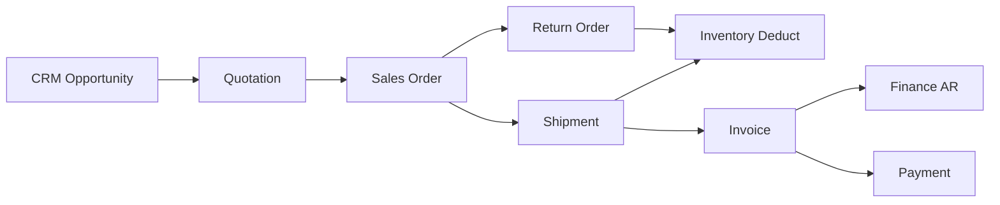

# AgainERP — Sales Domain Entity Catalog

> **Status:** Approved  
> **Version:** 1.0  
> **Project:** AgainERP  
> **Domain:** Sales (Sales & Revenue)  
> **Document Type:** Business Entity Design Document  
> **Purpose:** Define all Sales domain business entities — purpose, lifecycle, relationships, and platform capabilities  
> **Governance:** [GOVERNANCE.md](../../GOVERNANCE.md) · **Standards:** [DEVELOPMENT_STANDARDS.md](../../DEVELOPMENT_STANDARDS.md)

**No SQL schemas. No migrations. No DDL.**  
This document describes **business entities only** — quote-to-cash from customer through quotation, order, shipment, invoice, payment, and returns.

### Step 30 Requirements (Satisfied)

| Requirement | Section |
|-------------|---------|
| Domain overview | §1 |
| Entity philosophy | §2 |
| Entity registry | §3 |
| Per-entity profiles (8 attributes each) | §4 |
| Workflow support (Quotation → Return) | §5 |
| All 16 sales entities | §3 · §4 |

**Related:** [SALES_MODULE_ARCHITECTURE.md](./SALES_MODULE_ARCHITECTURE.md) · [SALES_WORKFLOW.md](./SALES_WORKFLOW.md) · [CRM_MODULE_ARCHITECTURE.md](../crm/CRM_MODULE_ARCHITECTURE.md) · [ENTITY_PURCHASE.md](../purchase/ENTITY_PURCHASE.md) · [ENTITY_INVENTORY.md](../inventory/ENTITY_INVENTORY.md) · [ENTITY_RELATIONSHIP_REGISTRY.md](../../ENTITY_RELATIONSHIP_REGISTRY.md) · [DATABASE_REGISTRY.md](../../DATABASE_REGISTRY.md) · [TRACEABILITY_MATRIX.md](../../TRACEABILITY_MATRIX.md)

---

## Executive summary

| Principle | Rule |
|-----------|------|
| **Quote-to-cash spine** | Sales owns revenue documents; Inventory owns qty; Finance owns AR |
| **Customer via Core** | Customer party = Core Contact — no duplicate customer master |
| **Product Master consumer** | Lines reference Catalog variant; price snapshot at confirm |
| **Orchestration not duplication** | Shipment triggers Inventory deduct; Invoice triggers Finance AR |
| **CRM native** | Opportunities feed quotations; pipeline informs Sales Pipeline view |
| **Omnichannel link** | Optional `commerce_order_id` — no duplicate line items |

```text
Sales Domain Entities (16)
├── Customer · Customer Address · Sales Pipeline
├── Quotation · Quotation Item
├── Sales Order · Sales Order Item
├── Shipment · Shipment Item
├── Invoice · Invoice Item
├── Payment · Payment Allocation · Credit Note
├── Return Order · Return Item
```

---

## 1. Domain overview

### 1.1 Sales bounded context

The **Sales** domain is AgainERP's **revenue and fulfillment orchestration system** — from customer quotation through order confirmation, shipment, invoicing, payment collection, and returns.

| Concern | Sales Owns | Sales Does Not Own |
|---------|-------------|---------------------|
| Customer (sales view) | Profile extension, credit limit | Core Contact record |
| Addresses | Usage on documents | Core Address storage |
| Revenue docs | Quotation, Order, Invoice, Credit Note | GL entries (Finance) |
| Fulfillment docs | Shipment | Stock Movement (Inventory) |
| Payments | Payment, Payment Allocation | Bank reconciliation (Finance) |
| Returns | Return Order | — |
| Pipeline view | Sales Pipeline metrics | CRM stage config (CRM) |
| Product identity | Line references only | SKU, specs (Catalog) |

### 1.2 Quote-to-cash chain



### 1.3 Channel integration

| Channel | Integration | Primary entities |
|---------|-------------|------------------|
| **Ecommerce** | `commerce_order_id` mirror; checkout → Sales Order (policy) | Sales Order |
| **B2B / Wholesale** | Full quote-to-cash at `/sales/*` | Quotation, Sales Order |
| **CRM** | Opportunity → Quotation → Won on invoice | Sales Pipeline |
| **Inventory** | Reserve on confirm; deduct on ship; restock on return | Sales Order, Shipment |
| **Finance** | Invoice → AR; Payment → cash receipt; Credit Note → AR reduction | Invoice, Payment |
| **POS** | Short-path order (future) | Sales Order, Payment |

### 1.4 Traceability

| Requirement | Sales entities |
|-------------|----------------|
| REQ-SALES-001 | Customer, Quotation, Sales Order, Shipment, Invoice, Payment, Return |
| REQ-ECOM-001 | Sales Order (omnichannel link) |

**Service owner:** `SalesService` · **Agent:** Sales Agent

---

## 2. Entity philosophy

### 2.1 Design principles

```text
One customer truth in Core Contacts.
One product truth in Catalog.
Sales documents chain forward — confirm before ship, ship before AR (policy).
```

| Principle | Application |
|-----------|-------------|
| **Aggregate roots** | Quotation, Sales Order, Shipment, Invoice, Payment, Return Order, Credit Note |
| **Line items** | Quotation Item, Order Item, Shipment Item, Invoice Item, Return Item |
| **Extension entities** | Customer (profile on Core Contact), Customer Address (Core Address) |
| **Allocation child** | Payment Allocation |
| **View entity** | Sales Pipeline — CRM + open quotes aggregate |
| **Price snapshot** | Order/invoice lines freeze price at document time |

### 2.2 Entity profile schema

Every entity in §4 includes:

| Attribute | Description |
|-----------|-------------|
| **Purpose** | Business reason the entity exists |
| **Responsibilities** | What the entity is accountable for |
| **Relationships** | Logical links to other entities |
| **Lifecycle** | States and transitions |
| **Activities** | Timeline, chatter, audit support |
| **Permissions** | Primary permission keys |
| **Approval Support** | Workflow gates, if any |
| **AI Support** | Agents and tools that may read or propose changes |

### 2.3 Document boundaries

| This document | See instead |
|-------------|-------------|
| Business entity definitions | [SALES_MODULE_ARCHITECTURE.md](./SALES_MODULE_ARCHITECTURE.md) |
| Workflow state machines | [SALES_WORKFLOW.md](./SALES_WORKFLOW.md) · §5 |
| Physical tables | [DATABASE_REGISTRY.md](../../DATABASE_REGISTRY.md) §5.4 |
| CRM pipeline config | [CRM_MODULE_ARCHITECTURE.md](../crm/CRM_MODULE_ARCHITECTURE.md) §8 |

---

## 3. Entity registry

| # | Entity | Aggregate | Owner | REQ | Status |
|---|--------|-----------|-------|-----|--------|
| 1 | [Customer](#41-customer) | Root (Core + extension) | Core · Sales profile | REQ-SALES-001 | Documented |
| 2 | [Customer Address](#42-customer-address) | Child of Customer | Core | REQ-SALES-001 | Documented |
| 3 | [Quotation](#43-quotation) | Root | Sales | REQ-SALES-001 | Documented |
| 4 | [Quotation Item](#44-quotation-item) | Child of Quotation | Sales | REQ-SALES-001 | Documented |
| 5 | [Sales Order](#45-sales-order) | Root | Sales | REQ-SALES-001, REQ-ECOM-001 | Documented |
| 6 | [Sales Order Item](#46-sales-order-item) | Child of Sales Order | Sales | REQ-SALES-001 | Documented |
| 7 | [Shipment](#47-shipment) | Root | Sales | REQ-SALES-001 | Documented |
| 8 | [Shipment Item](#48-shipment-item) | Child of Shipment | Sales | REQ-SALES-001 | Documented |
| 9 | [Invoice](#49-invoice) | Root | Sales | REQ-SALES-001 | Documented |
| 10 | [Invoice Item](#410-invoice-item) | Child of Invoice | Sales | REQ-SALES-001 | Documented |
| 11 | [Payment](#411-payment) | Root | Sales | REQ-SALES-001 | Documented |
| 12 | [Payment Allocation](#412-payment-allocation) | Child of Payment | Sales | REQ-SALES-001 | Documented |
| 13 | [Credit Note](#413-credit-note) | Root | Sales | REQ-SALES-001 | Documented |
| 14 | [Return Order](#414-return-order) | Root | Sales | REQ-SALES-001 | Documented |
| 15 | [Return Item](#415-return-item) | Child of Return Order | Sales | REQ-SALES-001 | Documented |
| 16 | [Sales Pipeline](#416-sales-pipeline) | Config / view | CRM config · Sales consume | REQ-SALES-001 | Documented |

---

## 4. Entity profiles

### 4.1 Customer

| Attribute | Value |
|-----------|-------|
| **Purpose** | Customer party — who buys goods and services; anchor for all revenue documents |
| **Responsibilities** | Core identity (name, email, phone); sales profile (credit limit, payment terms, price list, sales rep); block flag; AR balance visibility; revenue history |
| **Relationships** | → Core Contact (`contact_type=customer`); → Customer Addresses; → Sales Customer Profile extension; ← Quotations, Sales Orders, Invoices, Payments; ↔ CRM Account/Opportunity; optional → `commerce_orders` |
| **Lifecycle** | prospect → active → blocked → inactive |
| **Activities** | ✓ Full — profile edits, credit limit change, block/unblock |
| **Permissions** | `core.contact.view/create/edit`; `sales.customer.read`, `.write` |
| **Approval Support** | Optional — credit limit increase approval |
| **AI Support** | Churn risk score; credit insight; next best action |

**Rule:** No `sales_customers` table — identity lives in Core Contacts.

---

### 4.2 Customer Address

| Attribute | Value |
|-----------|-------|
| **Purpose** | Bill-to and ship-to location for a Customer — used on orders and shipments |
| **Responsibilities** | Structured address (Core Address); type flags (billing, shipping, both); default selection; validation for tax jurisdiction |
| **Relationships** | → Customer (Core Contact); referenced by → Sales Order (`bill_to`, `ship_to`); → Shipment delivery address |
| **Lifecycle** | active → inactive |
| **Activities** | ✓ Address add/edit on customer timeline |
| **Permissions** | `core.contact.edit`; `sales.customer.write` |
| **Approval Support** | — |
| **AI Support** | Address validation suggest; duplicate detect |

**Storage:** Core `addresses` polymorphic to Contact — Sales references by ID.

---

### 4.3 Quotation

| Attribute | Value |
|-----------|-------|
| **Purpose** | Formal price offer to customer before sales order — B2B, wholesale, project sales |
| **Responsibilities** | Quote number, validity dates, terms; line pricing and discounts; PDF send; revision versions; convert to Sales Order; link CRM opportunity |
| **Relationships** | → Customer; → Quotation Items; → CRM Opportunity (optional); → Sales Order (on convert); → Branch, Warehouse, Sales Rep |
| **Lifecycle** | draft → sent → negotiation → approved → so_created → closed \| rejected \| expired \| cancelled |

| **Activities** | ✓ Send, revise, approve, convert, expire, reject |
| **Permissions** | `sales.quotation.read`, `.create`, `.approve`, `.convert` |
| **Approval Support** | **Yes** — discount above threshold; price below margin floor |
| **AI Support** | Quote optimization; upsell/cross-sell; win probability from CRM |

**Workflow ID:** `sales.quotation` · **Events:** `sales.quotation.sent`, `.accepted`, `.converted`

---

### 4.4 Quotation Item

| Attribute | Value |
|-----------|-------|
| **Purpose** | Line on a Quotation — one product or service with quantity and offered price |
| **Responsibilities** | Product Variant or service description; quantity, unit price, discount, tax; promised delivery date; carries forward to Sales Order on convert |
| **Relationships** | → Quotation; → Product Variant; → Sales Order Item (on convert) |
| **Lifecycle** | open with quotation → converted \| cancelled with quotation |
| **Activities** | ✓ Line price/discount changes on quotation timeline |
| **Permissions** | `sales.quotation.create` |
| **Approval Support** | Inherits quotation discount approval |
| **AI Support** | Suggested price from price list and history |

---

### 4.5 Sales Order

| Attribute | Value |
|-----------|-------|
| **Purpose** | Confirmed customer revenue commitment — operational hub for fulfillment and billing |
| **Responsibilities** | Order number, customer, dates, ship/bill addresses; line qty tracking (ordered/shipped/invoiced/returned); credit check on confirm; stock reservation trigger; optional commerce order link |
| **Relationships** | → Customer, Customer Addresses; → Sales Order Items; → Quotation (source); → Shipments, Invoices, Return Orders; → Warehouse; optional → `commerce_order_id`; ↔ CRM Opportunity |
| **Lifecycle** | draft → submitted → approved → confirmed → partially_shipped → shipped → invoiced → closed \| rejected \| cancelled \| on_hold |

| **Activities** | ✓ Full — confirm, approve, ship link, invoice link, cancel, hold |
| **Permissions** | `sales.order.read`, `.create`, `.edit`, `.approve`, `.confirm`, `.cancel` |
| **Approval Support** | **Yes** — credit limit, discount, margin floor on submit/confirm |
| **AI Support** | Fraud/credit risk hold; upsell; demand forecast qty hint |

**Workflow ID:** `sales.order` · **Events:** `sales.order.confirmed`, `.approved`, `.cancelled`

---

### 4.6 Sales Order Item

| Attribute | Value |
|-----------|-------|
| **Purpose** | Line on a Sales Order — one SKU with quantity and snapshotted price |
| **Responsibilities** | `quantity_ordered`, `quantity_shipped`, `quantity_invoiced`, `quantity_returned`; unit price/discount/tax **snapshot at order time**; warehouse override per line |
| **Relationships** | → Sales Order; → Product Variant; ← Shipment Items, Invoice Items, Return Items |
| **Lifecycle** | open → partially_fulfilled → closed \| cancelled |
| **Activities** | ✓ Line edits, qty fulfillment updates |
| **Permissions** | `sales.order.create`, `.edit` |
| **Approval Support** | Inherits order approval |
| **AI Support** | Margin alert on line discount |

---

### 4.7 Shipment

| Attribute | Value |
|-----------|-------|
| **Purpose** | Delivery document — records physical fulfillment and triggers Inventory stock-out |
| **Responsibilities** | Shipment number, carrier, tracking; ship-from warehouse; partial ship support; update order shipped qty; batch/serial on lines |
| **Relationships** | → Sales Order; → Shipment Items; → Warehouse; → Stock Movements (Inventory, on complete); ← Return Order (optional) |
| **Lifecycle** | draft → picked → shipped → delivered |

| **Activities** | ✓ Pick, ship, deliver, tracking updates |
| **Permissions** | `sales.shipment.read`, `.create`, `.ship` |
| **Approval Support** | — (over-ship may require policy) |
| **AI Support** | Carrier/route suggest; delivery date predict |

**Workflow ID:** `sales.shipment` · **Event:** `sales.shipment.completed` → Inventory deduct + reservation release

---

### 4.8 Shipment Item

| Attribute | Value |
|-----------|-------|
| **Purpose** | Line on a Shipment — quantity shipped for one Sales Order line |
| **Responsibilities** | `quantity_shipped`; batch/serial when tracked; links to Inventory movement |
| **Relationships** | → Shipment; → Sales Order Item; → Batch, Serial Number (Inventory) |
| **Lifecycle** | draft with shipment → shipped (immutable after post) |
| **Activities** | ✓ On shipment timeline |
| **Permissions** | `sales.shipment.create` |
| **Approval Support** | — |
| **AI Support** | Pick qty validation vs order |

---

### 4.9 Invoice

| Attribute | Value |
|-----------|-------|
| **Purpose** | Customer billing document — creates Accounts Receivable in Finance |
| **Responsibilities** | Invoice number, dates, amounts; bill-to customer; link order/shipment; track paid/due balance; post to Accounting |
| **Relationships** | → Customer; → Invoice Items; → Sales Order, Shipment (optional); → Payment Allocations; ← Credit Note; → Finance AR Invoice (on post) |
| **Lifecycle** | draft → posted → partially_paid → paid → overdue \| cancelled |

| **Activities** | ✓ Create, post, payment apply, overdue flag |
| **Permissions** | `sales.invoice.read`, `.create`, `.post` |
| **Approval Support** | **Yes** — post before ship (policy); Finance sign-off on large invoices |
| **AI Support** | Payment date prediction; duplicate invoice detect |

**Workflow ID:** `sales.invoice` · **Event:** `sales.invoice.posted` → Finance AR

---

### 4.10 Invoice Item

| Attribute | Value |
|-----------|-------|
| **Purpose** | Line on an Invoice — billed quantity and amount for one order line |
| **Responsibilities** | Invoiced qty and unit price; tax; updates order `quantity_invoiced` |
| **Relationships** | → Invoice; → Sales Order Item; → Shipment Item (match, optional) |
| **Lifecycle** | draft with invoice → posted with invoice |
| **Activities** | ✓ On invoice timeline |
| **Permissions** | `sales.invoice.create` |
| **Approval Support** | Inherits invoice post approval |
| **AI Support** | Match assist order line to invoice line |

---

### 4.11 Payment

| Attribute | Value |
|-----------|-------|
| **Purpose** | Customer payment received — cash, bank, card, mobile wallet, cheque |
| **Responsibilities** | Payment number, date, amount, method, reference; allocation to open invoices; cleared/bounced status; handoff to Finance cash receipt |
| **Relationships** | → Customer; → Payment Allocations (1:n); → Invoices (via allocations); → Finance cash entry (on post) |
| **Lifecycle** | pending → cleared → fully_allocated \| bounced \| cancelled |

| **Activities** | ✓ Record, allocate, clear, bounce |
| **Permissions** | `sales.payment.read`, `.create`, `.allocate` |
| **Approval Support** | Large payment refund/chargeback may require approval (Finance policy) |
| **AI Support** | Auto-allocation suggest (oldest invoice first) |

**Workflow ID:** `sales.payment` · **Event:** `sales.payment.received` → Finance

---

### 4.12 Payment Allocation

| Attribute | Value |
|-----------|-------|
| **Purpose** | Application of payment amount to a specific Invoice — tracks AR settlement |
| **Responsibilities** | Allocated amount per invoice; partial allocation support; update invoice `amount_paid` / `amount_due` |
| **Relationships** | → Payment (parent); → Invoice |
| **Lifecycle** | active → reversed (on payment bounce or correction) |
| **Activities** | ✓ Allocation create/reverse on payment timeline |
| **Permissions** | `sales.payment.create` |
| **Approval Support** | — |
| **AI Support** | Optimal allocation order suggest |

---

### 4.13 Credit Note

| Attribute | Value |
|-----------|-------|
| **Purpose** | AR credit document — reduce customer balance for returns, refunds, or pricing corrections |
| **Responsibilities** | Credit note number, amount, reason; link source invoice and return; post to Finance AR reduction; may trigger refund payment |
| **Relationships** | → Customer; → Invoice (source); → Return Order (optional); line items (amount per SKU); → Finance AR credit (on post) |
| **Lifecycle** | draft → posted → applied \| cancelled |

| **Activities** | ✓ Create, approve, post, apply to invoice |
| **Permissions** | `sales.credit_note.read`, `.create`, `.post` |
| **Approval Support** | **Yes** — value threshold; manager + Finance |
| **AI Support** | Suggest credit amount from return lines |

**Workflow ID:** `sales.credit_note` · **Event:** `sales.credit_note.posted` → Finance

---

### 4.14 Return Order

| Attribute | Value |
|-----------|-------|
| **Purpose** | Customer RMA — authorize return of goods, restock, and financial credit |
| **Responsibilities** | RMA number, reason code; link original Sales Order/Shipment; approval workflow; trigger Inventory restock; link Credit Note |
| **Relationships** | → Customer; → Sales Order, Shipment; → Return Items; → Credit Note; → Stock Movements (return, +qty) |
| **Lifecycle** | requested → approved → received → restocked → credited \| rejected \| cancelled |

| **Activities** | ✓ Request, approve, receive, restock confirm, credit link |
| **Permissions** | `sales.return.read`, `.create`, `.approve`, `.receive` |
| **Approval Support** | **Yes** — outside window or high value |
| **AI Support** | Return reason validation; fraud pattern flag |

**Workflow ID:** `sales.return` · **Event:** `sales.return.received` → Inventory restock

**Reason codes:** defective · wrong_item · changed_mind · warranty · over_shipment

---

### 4.15 Return Item

| Attribute | Value |
|-----------|-------|
| **Purpose** | Line on a Return Order — quantity returned for one Sales Order line |
| **Responsibilities** | Return qty; batch/serial when tracked; condition code; updates order `quantity_returned` |
| **Relationships** | → Return Order; → Sales Order Item; → Shipment Item (optional); → Batch, Serial Number |
| **Lifecycle** | draft → received → credited |
| **Activities** | ✓ On return timeline |
| **Permissions** | `sales.return.create` |
| **Approval Support** | Inherits return approval |
| **AI Support** | Qty validation vs original ship |

---

### 4.16 Sales Pipeline

| Attribute | Value |
|-----------|-------|
| **Purpose** | Revenue funnel view — weighted pipeline combining CRM stages, open quotations, and confirmed orders |
| **Responsibilities** | Stage definitions (configured in CRM); probability weighting; open quote value; forecast by period; rep and team dashboards |
| **Relationships** | → CRM Pipeline / Stage (config); aggregates → Quotations, Opportunities, Sales Orders; consumed by Sales reports and AI forecast |
| **Lifecycle** | config (CRM) → active → archived (pipeline version) |
| **Activities** | ✓ Stage config changes (CRM); pipeline snapshot jobs |
| **Permissions** | `crm.pipeline.read` (config); `sales.report.view` (metrics) |
| **Approval Support** | CRM stage rule changes (admin policy) |
| **AI Support** | Revenue forecast; win probability; pipeline health narrative |

**Not a transactional document** — CRM owns stage config; Sales owns revenue documents that feed pipeline metrics.

---

## 5. Workflow support

Summary of state machines — full detail in [SALES_WORKFLOW.md](./SALES_WORKFLOW.md).

### 5.1 Quotation workflow

**ID:** `sales.quotation`

```text
Draft → Sent → Negotiation → Approved → SO Created
  ↓       ↓         ↓
Cancelled  Rejected / Expired
```

| Transition | Permission | Approval |
|------------|------------|----------|
| Send | `sales.quotation.create` | — |
| Revise | `sales.quotation.create` | — |
| Approve discount | `sales.quotation.approve` | Above threshold |
| Convert to SO | `sales.order.create` | Credit check |

Supports **quote versions** on each revise.

---

### 5.2 Order workflow

**ID:** `sales.order`

```text
Draft → Submitted → Approved → Confirmed → Partially Shipped → Shipped → Invoiced → Closed
              ↓           ↓
          Rejected    Cancelled / On Hold
```

| Transition | Side effect |
|------------|-------------|
| Confirm | `sales.order.confirmed` → Inventory reservation |
| Cancel | Release reservation |
| On Hold | Credit/fraud review |

Credit limit check: AR balance + open orders vs `credit_limit`.

---

### 5.3 Shipment workflow

**ID:** `sales.shipment`

```text
Draft → Picked → Shipped → Delivered
```

| Stage | Module impact |
|-------|---------------|
| Shipped | `sales.shipment.completed` → Inventory deduct, reservation release |
| Delivered | POD confirmation; CRM stage update (policy) |

Partial shipments update order `partially_shipped`.

---

### 5.4 Invoice workflow

**ID:** `sales.invoice`

```text
Draft → Posted → Partially Paid → Paid → Overdue
```

| Guard | Action |
|-------|--------|
| Post | `sales.invoice.posted` → Finance AR journal |
| Invoice on ship (policy) | Requires shipped qty > 0 |
| Overdue | Scheduled job from `due_date` |

---

### 5.5 Payment workflow

**ID:** `sales.payment`

```text
Pending → Cleared → Allocated (via Payment Allocation)
              ↓
           Bounced
```

| Step | Action |
|------|--------|
| Record | `sales.payment.received` |
| Allocate | Payment Allocation → update Invoice balances |
| Auto-allocate | Policy `sales.payment.allocation_auto` |

Finance owns bank reconciliation; Sales records commercial payment.

---

### 5.6 Return workflow

**ID:** `sales.return`

```text
Requested → Approved → Received → Restocked → Credited
```

| Stage | Module impact |
|-------|---------------|
| Received | Inventory return movement (+qty) |
| Credited | Credit Note posted → Finance AR reduction |

Refund payment optional after Credit Note.

---

### 5.7 Quote-to-cash entity flow

```text
Customer ──► Quotation ──► Quotation Item
                  │
                  ▼
           Sales Order ──► Sales Order Item
                  │
      ┌───────────┼───────────┐
      ▼           ▼           ▼
  Shipment    Invoice    Return Order
      │           │           │
      ▼           ▼           ▼
Stock Out    Payment ──► Payment Allocation
                  │
                  ▼
            Credit Note (if return/refund)
```

---

## 6. Cross-module integration matrix

| Entity | Inventory | Finance | CRM |
|--------|-----------|---------|-----|
| Sales Order | **Reserve** on confirm | — | Opportunity link |
| Shipment | **Deduct** on ship | — | — |
| Invoice | — | **AR post** | Won metric |
| Payment | — | **Cash receipt** | — |
| Return Order | **Restock** | Credit via Credit Note | — |
| Credit Note | — | **AR credit** | — |
| Sales Pipeline | — | Forecast input | **Stage config** |

---

## 7. Maintenance

| Trigger | Action |
|---------|--------|
| New sales entity | Add §3 + §4; update DATABASE_REGISTRY §5.4 |
| Workflow change | Update §5 + SALES_WORKFLOW.md + WORKFLOW_REGISTRY |
| Permission change | Sync API_REGISTRY Sales group |

**Registry owner:** Platform Team · **Review cadence:** Each sales epic before Pre-Code gate

---

*End of Sales Domain Entity Catalog — Step 30*
