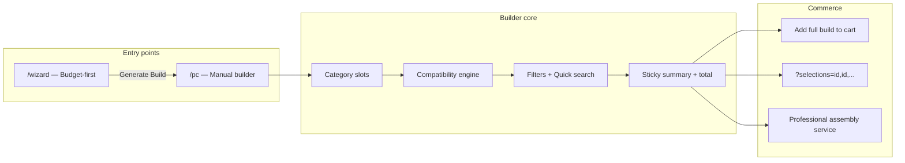

# Wootware PC Builder — Competitive Study

> **⚠️ Inspire only — not a clone target.** AgainERP aims for **AI-first + ERP + admin-friendly rules**, not a Wootware copy.  
> **Our blueprint:** [PC_BUILDER_UX_BLUEPRINT.md](./PC_BUILDER_UX_BLUEPRINT.md)  
> **Example build URL:** `/pc?selections=46253,48429,47112,47243,48128,50442,51730,49891,40035,46672,7435`  
> **Status:** Research for AgainERP UI prototype (design phase)  
> **Note:** Live site is Cloudflare-protected; analysis combines URL structure, public wizard page, customer reviews, and SA retailer patterns.

---

## ১. Executive summary

Wootware (South Africa, since 2007) is widely cited as an **industry benchmark** for PC builder UX in SA. Their builder runs on a **dedicated subdomain** (`builder.wootware.co.za`) separate from the main storefront — signaling that configurators deserve their own product surface, not a buried catalog page.

**Key takeaway for AgainERP:** Combine **wizard-first onboarding** (budget → CPU → GPU → size → generate) with a **manual configurator** (`/pc`) that supports **shareable selection URLs**, **multi-storage**, **strong filtering**, and **optional cooler** — then layer ERP (quote, lead, assembly service) on top.

---

## ২. Architecture (inferred)



| Surface | URL | Purpose |
|---------|-----|---------|
| Wizard | `/wizard` | Budget chips → CPU/GPU/Size → auto-generate |
| Manual | `/pc` | Full category picker, filters, multi-add |
| Share | `/pc?selections=…` | Comma-separated **catalog product IDs** |

### URL pattern analysis (user example)

```
/pc?selections=46253,48429,47112,47243,48128,50442,51730,49891,40035,46672,7435
```

| Observation | Implication |
|---------------|-------------|
| **11 numeric IDs** | More than 8 “core” slots — likely includes **cooler**, **multiple storage**, or **peripherals/OS** |
| **Flat list, no step encoding** | Server resolves each ID → category slot; order may not matter |
| **Human-shareable** | Simpler than base64 JSON tokens |
| **Bookmarkable** | Refresh restores full build |

**AgainERP today:** `?b=<base64>` encodes `{ stepId, productId }[]` — more explicit but less readable. **Recommendation:** support **both** `?selections=` (Wootware-style) and `?b=` (richer metadata).

---

## ৩. Wizard flow (documented from `/wizard`)

### Steps

1. **Choose Budget** (required) — preset chips, not free text  
   - R 15,000 · 20k · 25k · 28k · 35k · 40k · 45k · 50k · 55k · 60k · 70k · 90k  
2. **Processor (CPU)**  
3. **Graphics Card (GPU)**  
4. **Size** — likely ATX / mATX / compact (form factor intent)  
5. **Generate Build** — one-shot recommendation → manual `/pc` for tweaks  

### UX principles

| Principle | Wootware | AgainERP prototype |
|-----------|----------|-------------------|
| Budget as chips | ✓ ZAR presets | Wizard has budget; add **chip presets** (৳80k, ৳1.2L…) |
| Minimal wizard questions | 4 dimensions | 8+ wizard questions — consider **short path** |
| Generate → edit | ✓ | Wizard → Manual ✓ (already exists) |
| Size early | ✓ | Missing — add **case size / form factor** in wizard |

---

## ৪. Manual builder (`/pc`) — inferred from reviews + URL

### Category model (likely 10–12 slots)

Based on 11 IDs in share URL and standard SA custom PC articles:

| # | Category | Multi-add? | Required? |
|---|----------|----------|-----------|
| 1 | CPU | No | Yes |
| 2 | Motherboard | No | Yes |
| 3 | RAM | Yes | Yes |
| 4 | GPU | No | Yes (gaming) |
| 5 | SSD / NVMe | Yes | Yes |
| 6 | HDD | Yes | Optional |
| 7 | PSU | No | Yes |
| 8 | Case | No | Yes |
| 9 | CPU Cooler | No | Optional |
| 10 | Monitor | No | Optional |
| 11+ | OS / peripherals | ? | Optional |

**AgainERP alignment:** We now have RAM/SSD/HDD multi-add ✓. **Gap:** CPU Cooler as explicit step (coolers exist only in recommendations).

### Filtering (matches user screenshot reference)

Per-category side panel:

- **Quick Filter** — live text search on product name/specs  
- **Faceted checkboxes** — e.g. HDD Storage Capacity (480GB–512GB, 1TB, 2TB, 3TB…)  
- **Reset / Apply**  
- **Sort By** — price, availability  

**AgainERP:** Implemented in `builder-product-toolbar.tsx` + `product-list-utils.ts` ✓

### Build summary behaviour

| Behaviour | Wootware (expected) | AgainERP |
|-----------|---------------------|----------|
| Click “not selected” → jump to category | ✓ | ✓ (implemented) |
| Click selected part → edit category | ✓ | ✓ |
| Running total + VAT | ✓ ZAR inc. VAT | ✓ BDT `formatCurrency` |
| Compatibility status | ✓ (reviews praise this) | ✓ banner + rules |
| Add entire build to cart | ✓ | ✓ |

---

## ৫. Commerce & trust features (Wootware strengths)

From Trustpilot / MGR Gaming / Tech Girl reviews:

| Feature | Description | AgainERP opportunity |
|---------|-------------|---------------------|
| **Confirm availability** | Form to verify stock before buy | ERP real-time stock API |
| **Delivery calculator** | Shipping cost by courier | Link to `/shipping` + weight model |
| **Live chat** | Human help during build | CRM lead / WhatsApp CTA in summary |
| **Professional assembly** | Paid build + cable management + BIOS | **Configurator → Work Order** ERP flow |
| **Zero bloatware** | Service promise on pre-builts | Marketing copy / assembly checklist |
| **Order email automation** | Placed → paid → dispatched → review | Already in Orders module |

---

## ৬. Share & persistence comparison

| Platform | Share format | Pros | Cons |
|----------|--------------|------|------|
| **Wootware** | `?selections=46253,48429,…` | Simple, short, catalog-native | No step metadata; duplicate category handling server-side |
| **PCPartPicker** | `/list/xxxxxx` | Permanent list ID | External platform |
| **AgainERP (current)** | `?b=base64(json)` | Step + product mapping | Opaque, long URL |

### Recommended AgainERP share strategy

```
/builder/pc-builder?selections=pcb_cpu_i5,pcb_mobo_z790,pcb_ram_ddr5_32
/builder/pc-builder?b=eyJ...   (legacy / rich)
```

Hydration order: `selections` → `b` → localStorage persist.

---

## ৭. Gap analysis — AgainERP vs Wootware

| Area | Wootware | AgainERP prototype | Priority |
|------|----------|-------------------|----------|
| Dedicated builder subdomain | ✓ | Single `/builder` path | P3 |
| Budget wizard chips | ✓ | Partial | **P1** |
| Size / form factor in wizard | ✓ | Missing | **P1** |
| CPU Cooler step | Likely ✓ | Recommendations only | **P1** |
| `?selections=` share URL | ✓ | Adding | **P1** |
| Quick filter + facets + sort | ✓ | ✓ | Done |
| Multi RAM/SSD/HDD | ✓ | ✓ | Done |
| Summary click-to-navigate | ✓ | ✓ | Done |
| Performance scores | ? | Planned (PREMIUM_UX) | P2 |
| Assembly service CTA | ✓ | ERP actions prototype | **P2** |
| Availability confirm | ✓ | Stock badge only | P2 |
| Shipping estimate in summary | ✓ | Missing | P2 |

---

## ৮. Implementation roadmap (design prototype)

### Phase A — Wootware parity (current sprint)

- [x] Quick Filter + Filtering panel + Sort By  
- [x] Multi-add RAM / SSD / HDD  
- [x] Summary navigation to category  
- [ ] CPU Cooler optional step  
- [ ] `?selections=` URL hydrate + share  
- [ ] Wizard budget chips (৳ presets)  
- [ ] Wizard “Size” question (ATX / mATX / SFF)  

### Phase B — ERP differentiation

- [ ] Assembly / build service → quotation line item  
- [ ] Lead capture from incomplete builds  
- [ ] Real stock + branch availability in filter  
- [ ] Delivery estimate from case weight + address  

### Phase C — Premium (PREMIUM_UX_PLAN)

- [ ] Build score rings, FPS estimate  
- [ ] Community gallery / trending builds  

---

## ৯. Mock data mapping (11-item Wootware-like build)

Example AgainERP preset matching Wootware-style full build:

| Slot | Mock product ID |
|------|-----------------|
| CPU | `pcb_cpu_i5` |
| Motherboard | `pcb_mobo_b760_ddr5` |
| RAM ×1 | `pcb_ram_ddr5_32` |
| GPU | `pcb_gpu_4060` |
| SSD | `pcb_ssd_1tb` |
| HDD | `pcb_hdd_2tb` |
| PSU | `pcb_psu_650` |
| Case | `pcb_case_4000d` |
| Cooler | `pcb_cooler_tower` |
| Monitor | `pcb_mon_27_1440` |

Share URL:

```
/builder/pc-builder?selections=pcb_cpu_i5,pcb_mobo_b760_ddr5,pcb_ram_ddr5_32,pcb_gpu_4060,pcb_ssd_1tb,pcb_hdd_2tb,pcb_psu_650,pcb_case_4000d,pcb_cooler_tower,pcb_mon_27_1440
```

---

## ১০. Related AgainERP docs

| Doc | Link |
|-----|------|
| UI prototype master | [PROJECT.md](./PROJECT.md) |
| PC Builder wizard | [PC_BUILDER_WIZARD.md](../../modules/product-configurator/PC_BUILDER_WIZARD.md) |
| Premium UX plan | [PREMIUM_UX_PLAN.md](../../modules/product-configurator/PREMIUM_UX_PLAN.md) |
| AI assistant | [AI_PC_BUILDER_ASSISTANT.md](../../modules/product-configurator/AI_PC_BUILDER_ASSISTANT.md) |

---

## ১১. Sources

- [Wootware PC Wizard](https://builder.wootware.co.za/wizard) — budget / CPU / GPU / size flow  
- User-provided build URL — `selections=` parameter (11 product IDs)  
- [MGR Gaming — Wootware Review](https://mgrgaming.com/review-articles/wootware-review/) — filtering, availability, delivery  
- [Tech Girl — Wootware Review](https://techgirl.co.za/2020/05/26/online-shopping-review-wootware/) — navigation, search  
- [Trustpilot — Wootware](https://au.trustpilot.com/review/wootware.co.za) — builder praised as benchmark  
- [Hypertext — SA build guide using Wootware parts](https://htxt.co.za/2024/10/forget-a-ps5-pro-heres-a-great-pc-for-cheaper/) — typical component stack  

---

## ১২. Category alignment — Components · Extras · Peripherals

Wootware uses **top tabs** so 20+ slots never overwhelm the user. AgainERP maps the same idea:

| Tab | Slots | Required? | Compatibility |
|-----|-------|-----------|---------------|
| **Overview** | Progress, next steps, assembly CTA | — | Dashboard only |
| **Components** | CPU, Mobo, RAM, GPU, SSD, HDD, PSU, Case, Cooler | Cooler optional | **Full rule engine** |
| **Extras** | OS, Case Fans, WiFi, Accessories | All optional | None (add-on) |
| **Peripherals** | Monitor, Mouse, Keyboard, Pad, Controller, Headset, Mic, Speakers, Webcam | All optional | None |
| **Assembly** | Checkbox in summary footer (not a product slot) | Optional service | ERP work order |

### Wootware vs AgainERP (user-friendly wins)

| Pain point | Wootware | AgainERP |
|------------|----------|----------|
| Too many categories at once | Tabs help, but flat sidebar still long | **Collapsible phase groups** in summary |
| Assembly | Bottom checkbox | Same + **ERP assembly line** |
| OS / peripherals mixed with core | Separate tab | Separate tab + **AI skips optional** on first build |
| Empty slots | "PLEASE SELECT" | **Icon box + "Click to choose"** |
| Progress | Implicit | **Overview tab** with % + next required part |

### Mock implementation

- `lib/builder/phases.ts` — phase definitions + assembly service
- `builder-phase-tabs.tsx` — Overview \| Components \| Extras \| Peripherals
- `builder-overview-panel.tsx` — progress dashboard
- `pc-builder-extras-products.ts` — dummy OS, fans, mouse, etc.
- Summary — grouped accordions + assembly checkbox

---

*Last updated: 2026-06-15 — category phases added to prototype.*
